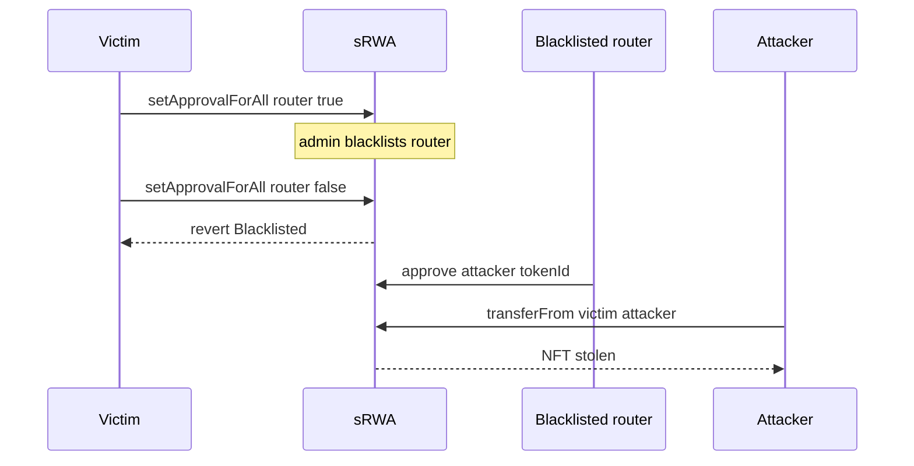

# Shiny sRWA — blacklisted operators cannot be revoked and can steal NFTs

> **Reproduction:** self-contained Foundry PoC (forge-std only) — no fork.
> Full trace: [output.txt](output.txt).

<!-- non-defihacklabs -->
<!-- source-auditvault: https://github.com/Auditware/AuditVault/blob/main/findings/64682-h-02-blacklisted-operators-can-not-be-revoked-from-being-an.md -->
<!-- date: 2025-01 -->

**AuditVault taxonomy:** lang/solidity · platform/shieldify · severity/high · sector/nft · sector/rwa · genome: broken-logic · direct-drain · account-ownership

---

## Key info

| | |
|---|---|
| **Impact** | **HIGH** — Victim NFTs stolen after operator is blacklisted because revoke reverts and the operator re-approves an unblacklisted attacker |
| **Protocol** | Shiny sRWA |
| **Bug class** | setApprovalForAll reverts on blacklisted operator even for approved=false; approve still usable by blacklisted operators |
| **Finding** | Shieldify Security (H-02) · #64682 |
| **Report** | https://github.com/shieldify-security/audits-portfolio-md/blob/main/Shiny-Security-Review.md |
| **Source** | [AuditVault](https://github.com/Auditware/AuditVault/blob/main/findings/64682-h-02-blacklisted-operators-can-not-be-revoked-from-being-an.md) |
| **Status** | Audit finding — reproduced as a standalone local synthetic |
| **Compiler** | `^0.8.24` (PoC) |

---

## TL;DR

setApprovalForAll reverts on blacklisted operator even for approved=false; approve still usable by blacklisted operators

**HARM:** Victim NFTs stolen after operator is blacklisted because revoke reverts and the operator re-approves an unblacklisted attacker

---

## Root cause

setApprovalForAll reverts on blacklisted operator even for approved=false; approve still usable by blacklisted operators

## Preconditions

Protocol-specific setup as described in the original finding (roles / managers / pending state in place).

## Attack walkthrough

See the synthetic `test/64682-h-02-blacklisted-operators-can-not-be-revoked-from-being-an.sol` and the Playground story beats. The `@> VULN` marker sits on the blamed executable line.

## Diagrams

## Impact

Victim NFTs stolen after operator is blacklisted because revoke reverts and the operator re-approves an unblacklisted attacker

## Sources

- [AuditVault finding](https://github.com/Auditware/AuditVault/blob/main/findings/64682-h-02-blacklisted-operators-can-not-be-revoked-from-being-an.md)
- Report: https://github.com/shieldify-security/audits-portfolio-md/blob/main/Shiny-Security-Review.md
- Reduced source provenance: github.com/ShinyUrban/SmartContracts@f49b5db sRWA.sol
