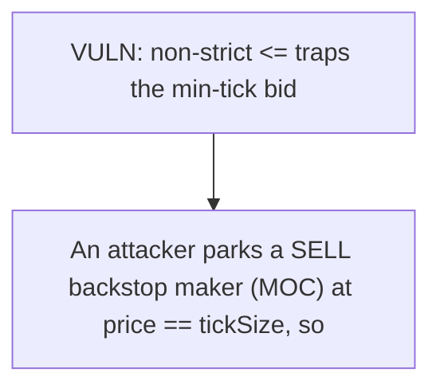

# GTE: Non-strict crossing check traps min-tick backstop bids

> **Vulnerability classes:** vuln/locked-funds · vuln/price
>
> **Reproduction:** a faithful minimal reproduction of the vulnerable finding — the vulnerable function is reproduced **verbatim** (marked `@>`) with faithful minimal doubles; local deploy, no fork.

<!-- source-auditvault: https://github.com/Auditware/AuditVault/blob/main/findings/64835-h-02-backstop-bid-side-frozen-by-tick-size-constraint-code4r.md -->

## Root cause

if (ds.getBestAsk() <= newOrder.price) uses a non-strict <=, so a backstop bid at the minimum tick is treated as crossing a min-tick ask and reverts, permanently freezing backstop bid placement at that level.

```solidity

    function _executeBuyOrder(Book storage ds, Order memory newOrder, TiF tif) internal {
        // if price crosses the book
        if (ds.getBestAsk() <= newOrder.price) { // @> CLOBLib.sol:231 non-strict `<=` traps the min-tick bid against a min-tick ask
            if (tif == TiF.MOC) revert PostOnlyOrderWouldBeFilled();
        }
```

## Why it's exploitable here

An attacker parks a SELL backstop maker (MOC) at price == tickSize, so getBestAsk() == tickSize; every legal backstop BID is a positive multiple of tickSize (minimum == tickSize == bestAsk), so the non-strict `getBestAsk() <= newOrder.price` post-only crossing rule always fires and reverts PostOnlyOrderWouldBeFilled — no backstop bid can ever be posted, permanently freezing the backstop bid side (liquidation-engine liveness DoS).

## Attack path



## Marked-line walkthrough (Playground)

The EVM Playground pins each step to the exact executed source line in `0x671d353a77…`:

1. **L124** — VULN: non-strict <= traps the min-tick bid: A min-tick backstop bid meets a min-tick ask; the <= comparison flags it as crossing and reverts, so the bid side is frozen.

## PoC

Registry (Foundry, local deploy — verbatim vulnerable source + harm-asserting test + negative control):

```bash
cd 64835-h-02-backstop-bid-side-frozen-by-tick-size-constraint-code4r_exp
forge test -vvv
```

The browser Playground replays the same synthetic opcode-for-opcode and measures the harm: **An attacker parks a SELL backstop maker (MOC) at price == tickSize, so getBestAsk() == tickSize; every legal backstop BID is a positive multiple of tickSize (minimum == tickSize == bestAsk), so the non-strict `getBestAsk() <= newOrder.price` post-only crossing rule always fires and reverts PostOnlyOrderWouldBeFilled — no backstop bid can ever be posted, permanently freezing the backstop bid side (liquidation-engine liveness DoS).**. Both gates are green (registry `forge test` PASS + Playground `_verify-poc` **VERDICT: PASS**).
