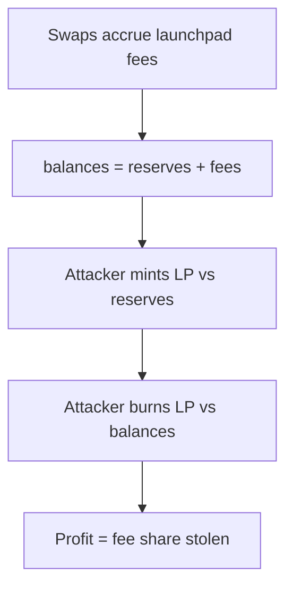

# GTE — burn over-estimates LP distribution when launchpad fees accrued

> **Vulnerability classes:** fee-calculation · direct-drain · fee-accounting

> **Reproduction:** self-contained Foundry PoC with only `forge-std`.
> Full trace: [output.txt](output.txt). PoC:
> [test/64851-h-03-gtelaunchpadv2pairburn-over-estimates-distribution-amou_exp.sol](test/64851-h-03-gtelaunchpadv2pairburn-over-estimates-distribution-amou_exp.sol).

<!-- non-defihacklabs -->
<!-- source-auditvault: https://github.com/Auditware/AuditVault/blob/main/findings/64851-h-03-gtelaunchpadv2pairburn-over-estimates-distribution-amou.md -->
<!-- date: 2025-08 -->

**AuditVault taxonomy:** `lang/solidity` · `platform/code4rena` · `has/github` · `has/poc` · `severity/high` · `sector/dex` · `sector/launchpad` · genome: `fee-calculation` · `direct-drain` · `fee-accounting`

---

## Key info

| | |
|---|---|
| **Impact** | **HIGH** — LP burn claims a share of accrued launchpad fees; repeatable drain |
| **Protocol** | [GTE](https://code4rena.com/reports/2025-08-gte-perps-and-launchpad) |
| **Vulnerable code** | `GTELaunchpadV2Pair.burn` amounts from balances |
| **Bug class** | Fee-inclusive pro-rata on burn |
| **Finding** | Code4rena 2025-08 GTE · #64851 · H-03 · AvantGard |
| **Report** | [Code4rena report](https://code4rena.com/reports/2025-08-gte-perps-and-launchpad) |
| **Source** | [AuditVault](https://github.com/Auditware/AuditVault/blob/main/findings/64851-h-03-gtelaunchpadv2pairburn-over-estimates-distribution-amou.md) |
| **Compiler** | `^0.8.24` (PoC) |

---

## TL;DR

1. Accrued launchpad fees sit in pair balances but are excluded from reserves.
2. `mint` prices LP against reserves; `burn` pays out against full balances.
3. Mint + burn captures a slice of fees that belong to the distributor.
4. HARM: positive token0 profit stolen from fee accrual (~9.09e21 units in the synthetic).

---

## The vulnerable code

```solidity
amount0 = liquidity.mul(balance0) / _totalSupply; // @> VULN
amount1 = liquidity.mul(balance1) / _totalSupply; // @> VULN
```

**Fix:** subtract `accruedLaunchpadFee{0,1}` from balances before pro-rata.

---

## Root cause

Reserves = balances − accrued launchpad fees. Burn ignores that split and treats fee inventory as LP-claimable.

---

## Preconditions

- Non-zero `accruedLaunchpadFee0` or `accruedLaunchpadFee1` (prior swaps, same block so fees not yet distributed).
- Attacker can mint and burn LP.

---

## Attack walkthrough

1. Seed pool with liquidity and token0 fee accrual.
2. Deposit proportional amounts; mint LP.
3. Transfer LP to pair and burn.
4. Receive more token0 than deposited — the fee over-claim.

---

## Diagrams



---

## Impact

Direct drain of launchpad fee inventory; repeatable same-block until fees are cleared.

---

## Sources

- AuditVault: https://github.com/Auditware/AuditVault/blob/main/findings/64851-h-03-gtelaunchpadv2pairburn-over-estimates-distribution-amou.md
- Report: https://code4rena.com/reports/2025-08-gte-perps-and-launchpad
- Repo@commit: https://github.com/code-423n4/2025-08-gte-perps/blob/f43e1eedb65e7e0327cfaf4d7608a37d85d2fae7/contracts/launchpad/uniswap/GTELaunchpadV2Pair.sol#L217-L218
