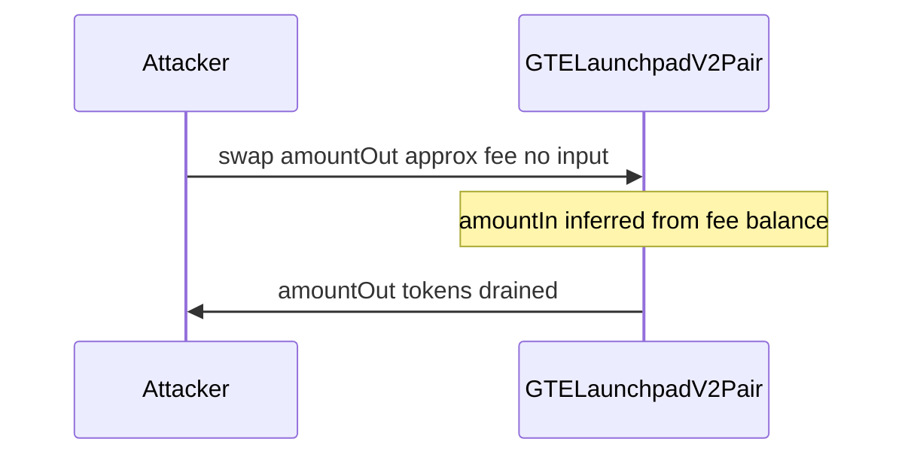

# GTE — swap drains pair via phantom amountIn from launchpad fees

> **Vulnerability classes:** fee-calculation · direct-drain · fee-accounting

> **Reproduction:** self-contained Foundry PoC with only `forge-std`.
> Full trace: [output.txt](output.txt). PoC:
> [test/64852-h-04-attacker-can-drain-funds-from-gtelaunchpadv2pair-using_exp.sol](test/64852-h-04-attacker-can-drain-funds-from-gtelaunchpadv2pair-using_exp.sol).

<!-- non-defihacklabs -->
<!-- source-auditvault: https://github.com/Auditware/AuditVault/blob/main/findings/64852-h-04-attacker-can-drain-funds-from-gtelaunchpadv2pair-using.md -->
<!-- date: 2025-08 -->

**AuditVault taxonomy:** `lang/solidity` · `platform/code4rena` · `has/github` · `has/poc` · `severity/high` · `sector/dex` · `sector/launchpad` · genome: `fee-calculation` · `direct-drain` · `fee-accounting`

---

## Key info

| | |
|---|---|
| **Impact** | **HIGH** — free token out up to ~accrued fees per swap; repeatable |
| **Protocol** | [GTE](https://code4rena.com/reports/2025-08-gte-perps-and-launchpad) |
| **Vulnerable code** | `GTELaunchpadV2Pair.swap` amountIn inference |
| **Bug class** | Balance/reserve mismatch with fees |
| **Finding** | Code4rena 2025-08 GTE · #64852 · H-04 · Nyxaris |
| **Report** | [Code4rena report](https://code4rena.com/reports/2025-08-gte-perps-and-launchpad) |
| **Source** | [AuditVault](https://github.com/Auditware/AuditVault/blob/main/findings/64852-h-04-attacker-can-drain-funds-from-gtelaunchpadv2pair-using.md) |
| **Compiler** | `^0.8.24` (PoC) |

---

## TL;DR

1. Reserves exclude accrued launchpad fees; balances include them.
2. `amountIn` is inferred as `balance - (reserve - amountOut)`.
3. Taking `amountOut ≈ fee` with no transfer credits a phantom amountIn.
4. K still holds (fee-inflated balances); attacker drains without paying.

---

## The vulnerable code

```solidity
uint256 amount0In = balance0 > _reserve0 - amount0Out ? balance0 - (_reserve0 - amount0Out) : 0; // @> VULN
uint256 amount1In = balance1 > _reserve1 - amount1Out ? balance1 - (_reserve1 - amount1Out) : 0; // @> VULN
```

**Fix:** subtract accrued launchpad fees when measuring amountIn and when checking K.

---

## Root cause

amountIn math treats fee inventory as if the attacker deposited it.

---

## Preconditions

- Non-zero accrued launchpad fees; same-block so fees not distributed.

---

## Attack walkthrough

1. Seed pair with reserves + fee0.
2. Call `swap(amount0Out ≈ fee0 * 997/1000, 0, attacker)` with no input transfer.
3. Pair credits phantom amount0In and pays out tokens.

---

## Diagrams



---

## Impact

Theft of pair inventory up to fee residual, repeatable same-block.

---

## Sources

- AuditVault: https://github.com/Auditware/AuditVault/blob/main/findings/64852-h-04-attacker-can-drain-funds-from-gtelaunchpadv2pair-using.md
- Report: https://code4rena.com/reports/2025-08-gte-perps-and-launchpad
- Repo@commit: https://github.com/code-423n4/2025-08-gte-perps/blob/f43e1eedb65e7e0327cfaf4d7608a37d85d2fae7/contracts/launchpad/uniswap/GTELaunchpadV2Pair.sol#L250-L251
