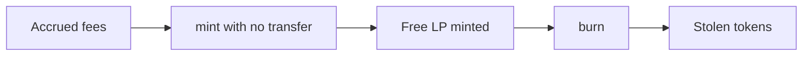

# GTE — free LP mint when accrued launchpad fees are non-zero

> **Vulnerability classes:** fee-calculation · direct-drain · fee-accounting

> **Reproduction:** self-contained Foundry PoC with only `forge-std`.
> Full trace: [output.txt](output.txt). PoC:
> [test/64853-h-05-gtelaunchpadv2pair-permits-minting-lp-tokens-for-free-w_exp.sol](test/64853-h-05-gtelaunchpadv2pair-permits-minting-lp-tokens-for-free-w_exp.sol).

<!-- non-defihacklabs -->
<!-- source-auditvault: https://github.com/Auditware/AuditVault/blob/main/findings/64853-h-05-gtelaunchpadv2pair-permits-minting-lp-tokens-for-free-w.md -->
<!-- date: 2025-08 -->

**AuditVault taxonomy:** `lang/solidity` · `platform/code4rena` · `has/github` · `has/poc` · `severity/high` · `sector/dex` · `sector/launchpad` · genome: `fee-calculation` · `direct-drain` · `fee-accounting`

---

## Key info

| | |
|---|---|
| **Impact** | **HIGH** — free LP then burn drains pair assets |
| **Protocol** | [GTE](https://code4rena.com/reports/2025-08-gte-perps-and-launchpad) |
| **Vulnerable code** | `GTELaunchpadV2Pair.mint` amount0/1 = balance − reserve |
| **Bug class** | Fee-inclusive deposit measurement |
| **Finding** | Code4rena 2025-08 GTE · #64853 · H-05 · AvantGard |
| **Report** | [Code4rena report](https://code4rena.com/reports/2025-08-gte-perps-and-launchpad) |
| **Source** | [AuditVault](https://github.com/Auditware/AuditVault/blob/main/findings/64853-h-05-gtelaunchpadv2pair-permits-minting-lp-tokens-for-free-w.md) |
| **Compiler** | `^0.8.24` (PoC) |

---

## TL;DR

1. Reserves = balances − fees.
2. `mint` without transfer sees amount = fees → free LP.
3. Burn cashes out the free share of pool assets.
4. HARM: both tokens stolen with zero deposit.

---

## The vulnerable code

```solidity
uint256 amount0 = balance0.sub(_reserve0); // @> VULN
uint256 amount1 = balance1.sub(_reserve1); // @> VULN
```

**Fix:** subtract accrued launchpad fees from the measured amounts.

---

## Root cause

Deposit delta equals fee residual when the caller transferred nothing.

---

## Preconditions

- Non-zero fees on both sides (or enough on one side after min with the other).
- Same-block fee retention.

---

## Attack walkthrough

1. Seed pool with fees on both tokens.
2. Call `mint` with no pre-transfer → free LP.
3. Burn free LP → extract tokens.

---

## Diagrams



---

## Impact

Drain of pair liquidity proportional to free LP minted; repeatable same-block.

---

## Sources

- AuditVault: https://github.com/Auditware/AuditVault/blob/main/findings/64853-h-05-gtelaunchpadv2pair-permits-minting-lp-tokens-for-free-w.md
- Report: https://code4rena.com/reports/2025-08-gte-perps-and-launchpad
- Repo@commit: https://github.com/code-423n4/2025-08-gte-perps/blob/f43e1eedb65e7e0327cfaf4d7608a37d85d2fae7/contracts/launchpad/uniswap/GTELaunchpadV2Pair.sol#L187-L188
