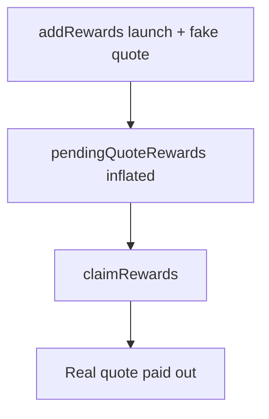

# GTE — Distributor addRewards with fake quoteToken drains real rewards

> **Vulnerability classes:** missing-validation · direct-drain · reward-theft

> **Reproduction:** self-contained Foundry PoC with only `forge-std`.
> Full trace: [output.txt](output.txt). PoC:
> [test/64854-h-06-donations-to-distributor-with-arbitrary-quotetoken-can_exp.sol](test/64854-h-06-donations-to-distributor-with-arbitrary-quotetoken-can_exp.sol).

<!-- non-defihacklabs -->
<!-- source-auditvault: https://github.com/Auditware/AuditVault/blob/main/findings/64854-h-06-donations-to-distributor-with-arbitrary-quotetoken-can.md -->
<!-- date: 2025-08 -->

**AuditVault taxonomy:** `lang/solidity` · `platform/code4rena` · `has/github` · `has/poc` · `severity/high` · `sector/dex` · `sector/launchpad` · genome: `direct-drain` · `reward-theft` · `reward-accounting`

---

## Key info

| | |
|---|---|
| **Impact** | **HIGH** — inflate quote rewards with fake token; claim real quote |
| **Protocol** | [GTE](https://code4rena.com/reports/2025-08-gte-perps-and-launchpad) |
| **Vulnerable code** | `Distributor.addRewards` |
| **Bug class** | Missing quoteAsset validation |
| **Finding** | Code4rena 2025-08 GTE · #64854 · H-06 · newspacexyz |
| **Report** | [Code4rena report](https://code4rena.com/reports/2025-08-gte-perps-and-launchpad) |
| **Source** | [AuditVault](https://github.com/Auditware/AuditVault/blob/main/findings/64854-h-06-donations-to-distributor-with-arbitrary-quotetoken-can.md) |
| **Compiler** | `^0.8.24` (PoC) |

---

## TL;DR

1. `addRewards(launch, fake, 0, amount)` accepts any token1.
2. Fake `transferFrom` succeeds; `pendingQuoteRewards` inflates.
3. Claims pay the **registered** real quote token.
4. HARM: attacker with stake drains real USDC rewards.

---

## The vulnerable code

```solidity
if (quoteAssetAmount > 0) {
    rs.addQuoteRewards(launchAsset, quoteAsset, quoteAssetAmount); // @> VULN: quoteAsset unvalidated
    quoteAsset.safeTransferFrom(msg.sender, address(this), uint256(quoteAssetAmount));
}
```

**Fix:** require provided quote equals the pool's registered `quoteAsset`.

---

## Root cause

Accounting updates use the caller-supplied quote address; payouts use storage `rs.quoteAsset`.

---

## Preconditions

- Existing reward pool with stakers and real quote inventory.
- Attacker holds some shares.

---

## Attack walkthrough

1. Stake a small share.
2. `addRewards` with malicious token1 and large amount1.
3. `claimRewards` → receive real quote.

---

## Diagrams



---

## Impact

Theft of distributor quote balances; can brick further claims for honest stakers.

---

## Sources

- AuditVault: https://github.com/Auditware/AuditVault/blob/main/findings/64854-h-06-donations-to-distributor-with-arbitrary-quotetoken-can.md
- Report: https://code4rena.com/reports/2025-08-gte-perps-and-launchpad
- Repo@commit: https://github.com/code-423n4/2025-08-gte-perps/blob/f43e1eedb65e7e0327cfaf4d7608a37d85d2fae7/contracts/launchpad/Distributor.sol#L106-L132
