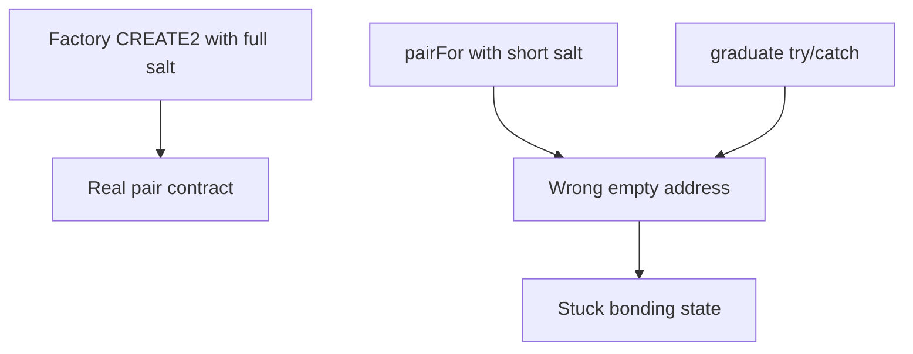

# GTE — Launchpad pairFor CREATE2 salt mismatches factory

> **Vulnerability classes:** wrong-condition · permanent · fot-slippage

> **Reproduction:** self-contained Foundry PoC with only `forge-std`.
> Full trace: [output.txt](output.txt). PoC:
> [test/64856-h-08-create2-address-of-the-uniswap-pair-used-by-launchpad-d_exp.sol](test/64856-h-08-create2-address-of-the-uniswap-pair-used-by-launchpad-d_exp.sol).

<!-- non-defihacklabs -->
<!-- source-auditvault: https://github.com/Auditware/AuditVault/blob/main/findings/64856-h-08-create2-address-of-the-uniswap-pair-used-by-launchpad-d.md -->
<!-- date: 2025-08 -->

**AuditVault taxonomy:** `lang/solidity` · `platform/code4rena` · `has/github` · `has/poc` · `severity/high` · `sector/dex` · `sector/launchpad` · genome: `wrong-condition` · `permanent`

---

## Key info

| | |
|---|---|
| **Impact** | **HIGH** — graduation / endRewards stuck when pair pre-exists |
| **Protocol** | [GTE](https://code4rena.com/reports/2025-08-gte-perps-and-launchpad) |
| **Vulnerable code** | `Launchpad.pairFor` salt |
| **Bug class** | CREATE2 salt mismatch |
| **Finding** | Code4rena 2025-08 GTE · #64856 · H-08 · codegpt |
| **Report** | [Code4rena report](https://code4rena.com/reports/2025-08-gte-perps-and-launchpad) |
| **Source** | [AuditVault](https://github.com/Auditware/AuditVault/blob/main/findings/64856-h-08-create2-address-of-the-uniswap-pair-used-by-launchpad-d.md) |
| **Compiler** | `^0.8.24` (PoC) |

---

## TL;DR

1. Factory salt = `keccak(token0, token1, launchpadLp, feeDistributor)`.
2. `pairFor` salt = `keccak(token0, token1)` only.
3. If `createPair` already exists, try/catch leaves the wrong predicted address.
4. HARM: graduation reverts forever against an empty address.

---

## The vulnerable code

```solidity
// @> VULN: salt omits launchpadLp + launchpadFeeDistributor
keccak256(abi.encodePacked(token0, token1))
```

**Fix:** match factory salt exactly.

---

## Root cause

Two different CREATE2 address formulas for the same pair.

---

## Preconditions

- Pair already created via factory before graduation path runs.

---

## Attack walkthrough

1. Pre-create the real factory pair.
2. Trigger graduation; `createPair` reverts PAIR_EXISTS.
3. Code keeps wrong `pairFor` address with no code → revert.

---

## Diagrams



---

## Impact

Permanent inability to graduate (and endRewards failures) for that token pair.

---

## Sources

- AuditVault: https://github.com/Auditware/AuditVault/blob/main/findings/64856-h-08-create2-address-of-the-uniswap-pair-used-by-launchpad-d.md
- Report: https://code4rena.com/reports/2025-08-gte-perps-and-launchpad
- Repo@commit: https://github.com/code-423n4/2025-08-gte-perps/blob/f43e1eedb65e7e0327cfaf4d7608a37d85d2fae7/contracts/launchpad/Launchpad.sol#L569-L587
