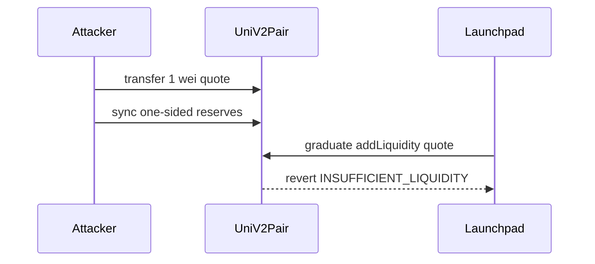

# GTE — DOS graduation via 1-wei donation + sync

> **Vulnerability classes:** frontrun · dos-resistance · frozen-funds

> **Reproduction:** self-contained Foundry PoC with only `forge-std`.
> Full trace: [output.txt](output.txt). PoC:
> [test/64857-h-09-dos-of-launchpad-graduation-via-addliquidity-with-1-wei_exp.sol](test/64857-h-09-dos-of-launchpad-graduation-via-addliquidity-with-1-wei_exp.sol).

<!-- non-defihacklabs -->
<!-- source-auditvault: https://github.com/Auditware/AuditVault/blob/main/findings/64857-h-09-dos-of-launchpad-graduation-via-addliquidity-with-1-wei.md -->
<!-- date: 2025-08 -->

**AuditVault taxonomy:** `lang/solidity` · `platform/code4rena` · `has/github` · `has/poc` · `severity/high` · `sector/dex` · `sector/launchpad` · genome: `frontrun` · `dos-resistance` · `frozen-funds`

---

## Key info

| | |
|---|---|
| **Impact** | **HIGH** — temporary DOS of token graduation |
| **Protocol** | [GTE](https://code4rena.com/reports/2025-08-gte-perps-and-launchpad) |
| **Vulnerable code** | `_graduate` → router `addLiquidity` → `quote` |
| **Bug class** | One-sided reserves break quote |
| **Finding** | Code4rena 2025-08 GTE · #64857 · H-09 · levantequarini |
| **Report** | [Code4rena report](https://code4rena.com/reports/2025-08-gte-perps-and-launchpad) |
| **Source** | [AuditVault](https://github.com/Auditware/AuditVault/blob/main/findings/64857-h-09-dos-of-launchpad-graduation-via-addliquidity-with-1-wei.md) |
| **Compiler** | `^0.8.24` (PoC) |

---

## TL;DR

1. Donate 1 wei quote to empty pair and `sync()`.
2. Reserves become one-sided `(0, >0)`.
3. `UniswapV2Library.quote` requires both reserves &gt; 0 → reverts.
4. HARM: graduation DOS.

---

## The vulnerable code

```solidity
require(reserveA > 0 && reserveB > 0, "UniswapV2Library: INSUFFICIENT_LIQUIDITY"); // @> VULN path
```

**Fix:** if either reserve is 0, bypass router and `pair.mint()` directly.

---

## Root cause

Graduation assumes empty pair (first mint) but attacker can create one-sided reserves first.

---

## Preconditions

- Target pair exists (or is creatable) before graduation liquidity is added.
- Attacker can transfer 1 wei + call sync.

---

## Attack walkthrough

1. Transfer 1 wei quote to pair; `sync()`.
2. Call graduation / addLiquidity path.
3. `quote` reverts → graduation fails.

---

## Diagrams



---

## Impact

Denial of launchpad graduation until reserves are corrected.

---

## Sources

- AuditVault: https://github.com/Auditware/AuditVault/blob/main/findings/64857-h-09-dos-of-launchpad-graduation-via-addliquidity-with-1-wei.md
- Report: https://code4rena.com/reports/2025-08-gte-perps-and-launchpad
- Repo@commit: https://github.com/code-423n4/2025-08-gte-perps/blob/f43e1eedb65e7e0327cfaf4d7608a37d85d2fae7/contracts/launchpad/Launchpad.sol#L500
