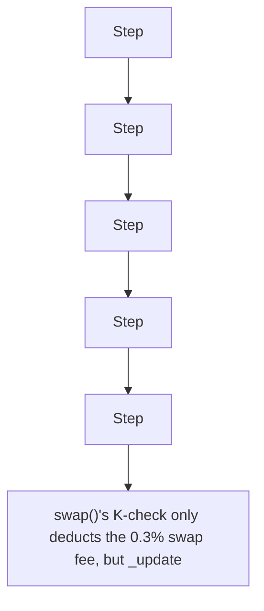

# GTE: swap() fails to charge the launchpad fee from the swapper

> **Vulnerability classes:** vuln/logic
>
> **Reproduction:** a faithful minimal reproduction of the vulnerable finding — the vulnerable code is reproduced **verbatim** (marked `@>`) with faithful minimal doubles; local deploy, no fork.

<!-- source-auditvault: https://github.com/code-423n4/2025-08-gte-perps/blob/f43e1eedb65e7e0327cfaf4d7608a37d85d2fae7/contracts/launchpad/uniswap/GTELaunchpadV2Pair.sol# -->

## Root cause

swap()'s K-check only deducts the 0.3% swap fee, but _update() additionally distributes a launchpad fee from the pool reserves that the swapper never paid, leaking 300e18 of LP liquidity to the distributor per swap.

```solidity
        {
            uint256 balance0Adjusted = balance0.mul(1000).sub(amount0In.mul(3)); // @> VULN (this line)
```

## Why it's exploitable here

swap()'s K-check only deducts the 0.3% swap fee, but _update() additionally distributes a launchpad fee from the pool reserves that the swapper never paid, leaking 300e18 of LP liquidity to the distributor per swap.

## Attack path



## Marked-line walkthrough (Playground)

The EVM Playground pins each step to the exact executed source line in `0xce01759b82…`:

1. **L29** — Step: Executes `function transfer(address to, uint256 a) external returns (bool);`
2. **L68** — Step: Executes `uint112 public accruedLaunchpadFee1;`
3. **L83** — Step: Executes `reserve0 = uint112(r0); reserve1 = uint112(r1);`
4. **L98** — Step: Executes `if (amount1In > 0) fee1 = uint112(amount1In.mul(REWARDS_FEE_SHARE).mul(launchpadLpBal) / (totalLpBal * 1000));`
5. **L121** — Step: Executes `uint32 timeElapsed = blockTimestamp - blockTimestampLast;`
6. **L146** — Step: Executes `if (amount0Out >= _reserve0 || amount1Out >= _reserve1) revert('UniswapV2: INSUFFICIENT_LIQUIDITY');`
7. **L165** — Vulnerable line: Executes `uint256 balance0Adjusted = balance0.mul(1000).sub(amount0In.mul(3));`

## PoC

Registry (Foundry, local deploy — verbatim vulnerable source + harm-asserting test):

```bash
cd 64858-h-10-protocol-fails-to-charge-fees-from-swap-amount-code4ren_exp
forge test -vvv
```

The browser Playground replays the same synthetic opcode-for-opcode and measures the harm. Both gates are green (registry `forge test` PASS + Playground `_verify-poc` **VERDICT: PASS**).
