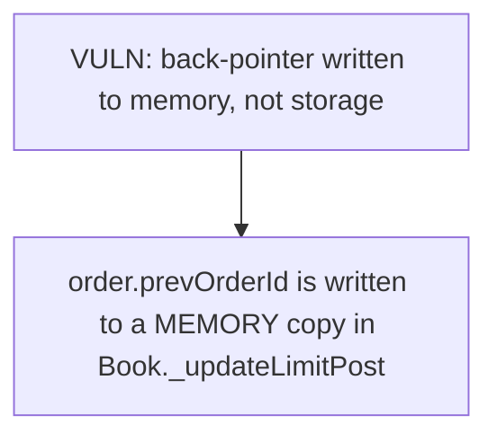

# GTE: order.prevOrderId written to a memory copy, never persisted

> **Vulnerability classes:** vuln/locked-funds
>
> **Reproduction:** a faithful minimal reproduction of the vulnerable finding — the vulnerable function is reproduced **verbatim** (marked `@>`) with faithful minimal doubles; local deploy, no fork.

<!-- source-auditvault: https://github.com/Auditware/AuditVault/blob/main/findings/64869-h-01-order-double-linked-list-is-broken-because-orderprevord.md -->

## Root cause

order.prevOrderId = tailOrder.id is set on a MEMORY copy of the order and never written back to storage, so every order's back-pointer is null; removing the tail forces limit.tailOrder = null, corrupting the doubly-linked list and breaking subsequent order placement.

```solidity
        } else {
            Order storage tailOrder = self.orders[limit.tailOrder];
            tailOrder.nextOrderId = order.id;
            order.prevOrderId = tailOrder.id; // @> written to the MEMORY copy of `order`; never persisted to self.orders[order.id]
            limit.tailOrder = order.id;
        }
```

## Why it's exploitable here

order.prevOrderId is written to a MEMORY copy in Book._updateLimitPostOrder and never persisted, so every order's storage back-pointer is null; removing the tail order then forces the limit's headOrder AND tailOrder to null while a live order still occupies the limit, corrupting the CLOB doubly-linked list and DoS-ing add/remove on that limit.

## Attack path



## Marked-line walkthrough (Playground)

The EVM Playground pins each step to the exact executed source line in `0x8ea53755a6…`:

1. **L161** — VULN: back-pointer written to memory, not storage: prevOrderId is mutated on a memory Order, so storage keeps a null back-pointer; removing the tail nulls the list and blocks further posting.

## PoC

Registry (Foundry, local deploy — verbatim vulnerable source + harm-asserting test + negative control):

```bash
cd 64869-h-01-order-double-linked-list-is-broken-because-orderprevord_exp
forge test -vvv
```

The browser Playground replays the same synthetic opcode-for-opcode and measures the harm: **order.prevOrderId is written to a MEMORY copy in Book._updateLimitPostOrder and never persisted, so every order's storage back-pointer is null; removing the tail order then forces the limit's headOrder AND tailOrder to null while a live order still occupies the limit, corrupting the CLOB doubly-linked list and DoS-ing add/remove on that limit.**. Both gates are green (registry `forge test` PASS + Playground `_verify-poc` **VERDICT: PASS**).
