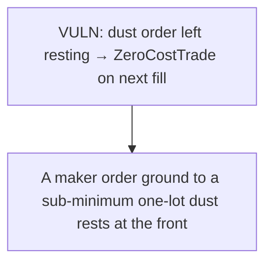

# GTE: A maker order ground to a sub-minimum one-lot dust rests at the front of the book; a subse

> **Vulnerability classes:** vuln/locked-funds · vuln/price
>
> **Reproduction:** a faithful minimal reproduction of the vulnerable finding — the vulnerable function is reproduced **verbatim** (marked `@>`) with faithful minimal doubles; local deploy, no fork.

<!-- source-auditvault: https://github.com/Auditware/AuditVault/blob/main/findings/64870-h-02-dust-orders-can-block-order-posting-code4rena-gte-gte-g.md -->

## Root cause

A maker order ground to a sub-minimum one-lot dust rests at the front of the book; a subsequent healthy taker fill first matches the dust, computing quoteDelta = baseDelta*price/baseSize == 0, so totalQuoteSent stays 0 and the fill reverts with ZeroCostTrade — the taker is denied execution and the real liquidity resting behind the dust is unreachable (permanent liveness DoS/griefing at that price 

```solidity
        }

        if (orderRemoved) ds.removeOrderFromBook(makerOrder);
        else makerOrder.amount -= matchData.baseDelta; // @> no min-amount re-check: leaves a sub-minimum DUST order resting at the front of the book
    }

```

## Why it's exploitable here

A maker order ground to a sub-minimum one-lot dust rests at the front of the book; a subsequent healthy taker fill first matches the dust, computing quoteDelta = baseDelta*price/baseSize == 0, so totalQuoteSent stays 0 and the fill reverts with ZeroCostTrade — the taker is denied execution and the real liquidity resting behind the dust is unreachable (permanent liveness DoS/griefing at that price level).

## Attack path



## Marked-line walkthrough (Playground)

The EVM Playground pins each step to the exact executed source line in `0x8ea53755a6…`:

1. **L687** — VULN: dust order left resting → ZeroCostTrade on next fill: The round-down of quoteDelta to 0 for a sub-minimum dust order makes the next taker fill revert ZeroCostTrade, blocking order posting at that price.

## PoC

Registry (Foundry, local deploy — verbatim vulnerable source + harm-asserting test + negative control):

```bash
cd 64870-h-02-dust-orders-can-block-order-posting-code4rena-gte-gte-g_exp
forge test -vvv
```

The browser Playground replays the same synthetic opcode-for-opcode and measures the harm: **A maker order ground to a sub-minimum one-lot dust rests at the front of the book; a subsequent healthy taker fill first matches the dust, c**. Both gates are green (registry `forge test` PASS + Playground `_verify-poc` **VERDICT: PASS**).
