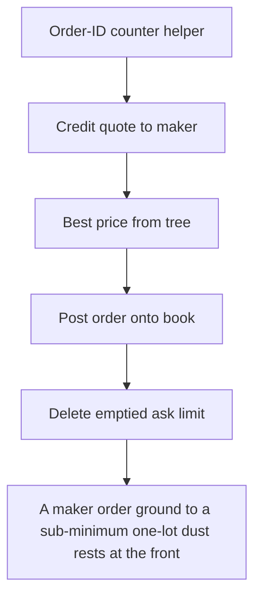

# GTE: A maker order ground to a sub-minimum one-lot dust rests at the front of the book; a subse

> **Vulnerability classes:** vuln/locked-funds · vuln/price
>
> **Reproduction:** a faithful minimal reproduction of the vulnerable finding — the vulnerable function is reproduced **verbatim** (marked `@>`) with faithful minimal doubles; local deploy, no fork.

<!-- source-auditvault: https://github.com/Auditware/AuditVault/blob/main/findings/64870-h-02-dust-orders-can-block-order-posting-code4rena-gte-gte-g.md -->

## Root cause

A maker order ground to a sub-minimum one-lot dust rests at the front of the book; a subsequent healthy taker fill first matches the dust, computing quoteDelta = baseDelta*price/baseSize == 0, so totalQuoteSent stays 0 and the fill reverts with ZeroCostTrade — the taker is denied execution and the real liquidity resting behind the dust is unreachable (permanent liveness DoS/griefing at that price 

```solidity
        }

        if (orderRemoved) ds.removeOrderFromBook(makerOrder);
        else makerOrder.amount -= matchData.baseDelta; // @> no min-amount re-check: leaves a sub-minimum DUST order resting at the front of the book
    }

```

## Why it's exploitable here

A maker order ground to a sub-minimum one-lot dust rests at the front of the book; a subsequent healthy taker fill first matches the dust, computing quoteDelta = baseDelta*price/baseSize == 0, so totalQuoteSent stays 0 and the fill reverts with ZeroCostTrade — the taker is denied execution and the real liquidity resting behind the dust is unreachable (permanent liveness DoS/griefing at that price level).

## Attack path



## Marked-line walkthrough (Playground)

The EVM Playground pins each step to the exact executed source line in `0x8ea53755a6…`:

1. **L73** — Order-ID counter helper: Setup: increments and returns a monotonic counter used to assign order IDs.
2. **L164** — Credit quote to maker: Setup: credits filled quote-token proceeds back to the maker's account.
3. **L261** — Best price from tree: Setup: returns the smallest key in the red-black tree — the front-of-book price where the dust order will rest.
4. **L364** — Post order onto book: Setup: inserts a resting maker order at its price level, including the sub-minimum dust lot the attacker leaves.
5. **L431** — Delete emptied ask limit: Setup: clears an ask price level once its last order is removed.
6. **L528** — Initialize market book: Setup: configures the book's market parameters at creation.
7. **L687** — Fill against dust maker: Matches the front dust maker, cutting its tiny `amount` by `baseDelta`; the sub-minimum lot makes quoteDelta==0 and the fill reverts ZeroCostTrade — no dust guard.

## PoC

Registry (Foundry, local deploy — verbatim vulnerable source + harm-asserting test + negative control):

```bash
cd 64870-h-02-dust-orders-can-block-order-posting-code4rena-gte-gte-g_exp
forge test -vvv
```

The browser Playground replays the same synthetic opcode-for-opcode and measures the harm: **A maker order ground to a sub-minimum one-lot dust rests at the front of the book; a subsequent healthy taker fill first matches the dust, c**. Both gates are green (registry `forge test` PASS + Playground `_verify-poc` **VERDICT: PASS**).
