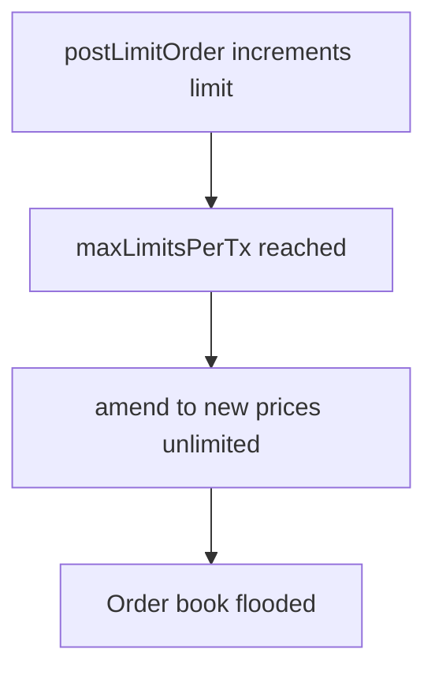

# GTE CLOB — amend bypasses maxLimitsPerTx

> **Vulnerability classes:** dos-resistance · temporary · account-ownership

> **Reproduction:** self-contained Foundry PoC with only `forge-std`.
> Full trace: [output.txt](output.txt). PoC:
> [test/64871-h-03-dos-attack-via-order-amendment-bypassing-maxlimitspertx_exp.sol](test/64871-h-03-dos-attack-via-order-amendment-bypassing-maxlimitspertx_exp.sol).

<!-- non-defihacklabs -->
<!-- source-auditvault: https://github.com/Auditware/AuditVault/blob/main/findings/64871-h-03-dos-attack-via-order-amendment-bypassing-maxlimitspertx.md -->
<!-- date: 2025-07 -->

**AuditVault taxonomy:** `lang/solidity` · `platform/code4rena` · `has/github` · `has/poc` · `severity/high` · `sector/dex` · genome: `dos-resistance` · `temporary` · `frozen-funds`

---

## Key info

| | |
|---|---|
| **Impact** | **HIGH** — unlimited price-level churn per tx; DOS protection bypass |
| **Protocol** | [GTE CLOB](https://code4rena.com/reports/2025-07-gte-spot-clob-and-router) |
| **Vulnerable code** | `CLOB.amend` missing `incrementLimitsPlaced` |
| **Bug class** | Incomplete rate-limit on book mutations |
| **Finding** | Code4rena 2025-07 GTE · #64871 · H-03 · eightzerofour |
| **Report** | [Code4rena report](https://code4rena.com/reports/2025-07-gte-spot-clob-and-router) |
| **Source** | [AuditVault](https://github.com/Auditware/AuditVault/blob/main/findings/64871-h-03-dos-attack-via-order-amendment-bypassing-maxlimitspertx.md) |
| **Compiler** | `^0.8.24` (PoC) |

---

## TL;DR

1. `postLimitOrder` enforces `maxLimitsPerTx` via `incrementLimitsPlaced`.
2. `amend` to a new price creates a new book position without incrementing.
3. Attacker posts up to the cap, then amends unlimited times in one tx.
4. HARM: order-book flooding / DOS protection bypass.

---

## The vulnerable code

```solidity
function amend(...) external {
    // @> VULN: no incrementLimitsPlaced when price/side changes
    return _processAmend(ds, order, args);
}
```

**Fix:** call `incrementLimitsPlaced` when `price` or `side` changes.

---

## Root cause

Amend-to-new-price is operationally a new limit placement but not rate-limited.

---

## Preconditions

- Ability to post at least one limit order.
- `maxLimitsPerTx` configured (DOS guard present).

---

## Attack walkthrough

1. Post `maxLimitsPerTx` orders (third post reverts).
2. Amend first order across 50 prices in the same tx.
3. Limits counter stays at 2; book sees 50 new levels.

---

## Diagrams



---

## Impact

Bypasses the protocol's per-tx order-book spam protection.

---

## Sources

- AuditVault: https://github.com/Auditware/AuditVault/blob/main/findings/64871-h-03-dos-attack-via-order-amendment-bypassing-maxlimitspertx.md
- Report: https://code4rena.com/reports/2025-07-gte-spot-clob-and-router
- Repo@commit: https://github.com/code-423n4/2025-07-gte-clob/blob/9f06332ebd4cfe2577d9eae81aeb58d3662ffccd/contracts/clob/CLOB.sol#L390
