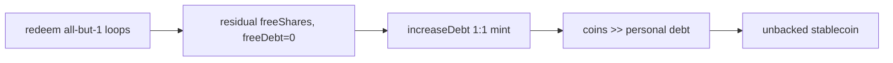

# Monolith — free-debt rounding allows unbacked borrow

> **Vulnerability classes:** precision-loss · direct-drain · integer-bounds

> **Reproduction:** self-contained Foundry PoC with only `forge-std`.
> Full trace: [output.txt](output.txt). PoC:
> [test/64955-h-1-user-can-abuse-rounding-issue-in-order-to-borrow-unbacke_exp.sol](test/64955-h-1-user-can-abuse-rounding-issue-in-order-to-borrow-unbacke_exp.sol).

<!-- non-defihacklabs -->
<!-- source-auditvault: https://github.com/Auditware/AuditVault/blob/main/findings/64955-h-1-user-can-abuse-rounding-issue-in-order-to-borrow-unbacke.md -->
<!-- date: 2025-12 -->

**AuditVault taxonomy:** `lang/solidity` · `sector/lending` · `sector/stable` · `platform/sherlock` · `has/github` · `has/poc` · `severity/high` · `impact/loss-of-funds/direct-drain` · genome: `precision-loss` · `direct-drain` · `integer-bounds`

---

## Key info

| | |
|---|---|
| **Impact** | **HIGH** — unbacked stablecoin mint; drain of free-debt / protocol funds |
| **Protocol** | [Monolith Stablecoin Factory](https://github.com/sherlock-audit/2025-12-monolith-stablecoin-factory) |
| **Vulnerable code** | `Lender.increaseDebt` free-debt branch — 1:1 mint when `totalFreeDebt == 0` |
| **Bug class** | Rounding / residual free-debt shares |
| **Finding** | Sherlock 2025-12-monolith · #64955 · H-1 · multi-reporter |
| **Report** | [Sherlock judging](https://github.com/sherlock-audit/2025-12-monolith-stablecoin-factory-judging) |
| **Source** | [AuditVault](https://github.com/Auditware/AuditVault/blob/main/findings/64955-h-1-user-can-abuse-rounding-issue-in-order-to-borrow-unbacke.md) |
| **Status** | Local synthetic PoC (fix noted as non-trivial in report) |
| **Compiler** | `^0.8.24` (PoC) |

---

## TL;DR

1. Free-debt share math rounds personal debt **up**.
2. Redeem + debase loops inflate `freeShares / freeDebt`; residual shares can survive after the last free-debt wei is repaid.
3. With `totalFreeDebt == 0` and residual shares still on the pool, the next borrow mints shares **1:1**.
4. New coins are issued against a share pool that still has ~1e32 leftover shares → personal debt ≪ coins received.
5. HARM: unbacked mint (e.g. 1e27 coins for ~1e22 debt).

---

## The vulnerable code

```solidity
uint256 shares = totalFreeDebt == 0 ? amount : amount.mulDivUp(totalFreeDebtShares, totalFreeDebt); // @> VULN
```

**Fix:** refuse (or reset) free-debt share minting when residual free shares remain with zero free debt; keep personal/global debt rounding consistent under redeem.

---

## Root cause

`increaseDebt` treats an empty free-debt pool as a fresh 1:1 market even when `totalFreeDebtShares > 0`. Residual shares from round-up + redeem-all-but-1 make that pool non-empty in share terms while empty in debt terms, so new borrowers receive full coin mint with a diluted liability.

---

## Preconditions

- Free-debt / redeemable path enabled for attacker-controlled accounts.
- Ability to run redeem loops (or otherwise leave residual free shares with zero free debt).

---

## Attack walkthrough

1. Inflate free-share ratio via borrow + redeem-all-but-1 (and debasement when ratio > 1e9).
2. Use a second wallet so the last free-debt wei can be repaid while residual shares remain.
3. Borrow a large amount while `totalFreeDebt == 0` → 1:1 share mint.
4. `getDebtOf` against the residual share pool is orders of magnitude below coins received.

---

## Diagrams



---

## Impact

Attacker mints unbacked stablecoin and can drain protocol free-debt / collateral backing. Finding logs show ~1e27 borrowed against ~1e22 debt.

---

## Sources

- [AuditVault finding #64955](https://github.com/Auditware/AuditVault/blob/main/findings/64955-h-1-user-can-abuse-rounding-issue-in-order-to-borrow-unbacke.md)
- [Sherlock 2025-12-monolith judging](https://github.com/sherlock-audit/2025-12-monolith-stablecoin-factory-judging/issues/734)
- Vulnerable tree: [Monolith Lender.sol](https://github.com/sherlock-audit/2025-12-monolith-stablecoin-factory/blob/main/Monolith/src/Lender.sol)
