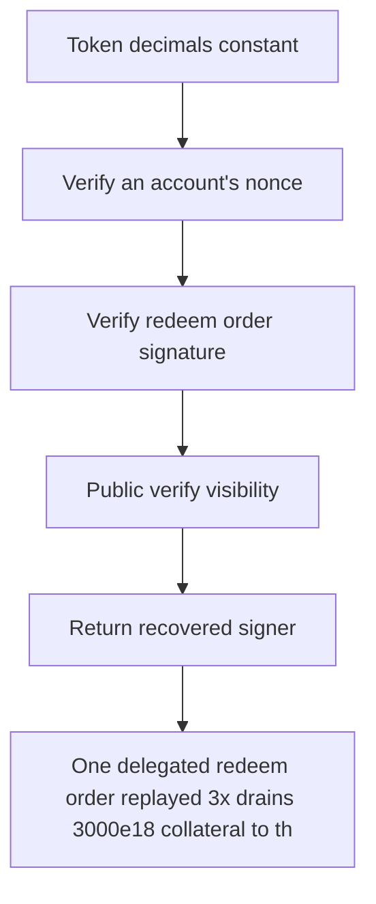

# Tenbin: One delegated redeem order replayed 3x drains 3000e18 collateral to the attacker (order.re

> **Vulnerability classes:** vuln/theft · vuln/locked-funds
>
> **Reproduction:** a faithful minimal reproduction of the vulnerable finding — the vulnerable function is reproduced **verbatim** (marked `@>`) with faithful minimal doubles; local deploy, no fork.

<!-- source-auditvault: https://github.com/Auditware/AuditVault/blob/main/findings/64973-redeem-nonce-mis-tracked-enables-replay-spearbit-none-tenbin.md -->

## Root cause

One delegated redeem order replayed 3x drains 3000e18 collateral to the attacker (order.recipient) and burns the victim/payer's assets 3x, because redeem records the nonce under the signer's slot while validating the payer's, so the payer nonce is never consumed.

```solidity
    // ── verbatim vulnerable redeem (Controller.sol L306-307) ──────────────────
    function redeem(Order calldata order, Signature calldata signature) external onlyRole(MINTER_ROLE) {
        (address signer,) = verifyOrder(order, signature); // checks payer nonce
        nonces[signer][order.nonce] = true; // @> records SIGNER's nonce, not the payer's — the payer nonce checked above is never consumed, so a delegated order replays
        IERC20(order.collateral_token).safeTransferFrom(manager, order.recipient, order.collateral_amount);
        AssetToken(asset).burn(order.payer, order.asset_amount);
```

## Why it's exploitable here

One delegated redeem order replayed 3x drains 3000e18 collateral to the attacker (order.recipient) and burns the victim/payer's assets 3x, because redeem records the nonce under the signer's slot while validating the payer's, so the payer nonce is never consumed.

## Attack path



## Marked-line walkthrough (Playground)

The EVM Playground pins each step to the exact executed source line in `0xbd4fd5a3ce…`:

1. **L42** — Token decimals constant: Setup: declares the token's 18 decimals.
2. **L160** — Verify an account's nonce: Setup: checks that `nonce` is unused for a given account — called on the payer, whose slot is what must actually be consumed.
3. **L167** — Verify redeem order signature: Setup: validates the order signature and recovers the delegated `signer` who authorized it.
4. **L168** — Public verify visibility: Setup: `verifyOrder` is publicly callable — this keyword is part of its signature.
5. **L170** — Return recovered signer: Setup: hands back the recovered `signer` address and a validity flag to the caller.
6. **L177** — Redeem entry, minter-gated: Setup: `redeem` burns the payer's assets and pays collateral to `order.recipient`, guarded by `MINTER_ROLE`.
7. **L179** — Nonce marked under wrong account: Records the nonce under the recovered `signer`'s slot, but validation checks the payer's slot, so the payer nonce is never consumed and the order replays.

## PoC

Registry (Foundry, local deploy — verbatim vulnerable source + harm-asserting test + negative control):

```bash
cd 64973-redeem-nonce-mis-tracked-enables-replay-spearbit-none-tenbin_exp
forge test -vvv
```

The browser Playground replays the same synthetic opcode-for-opcode and measures the harm: **One delegated redeem order replayed 3x drains 3000e18 collateral to the attacker (order.recipient) and burns the victim/payer's assets 3x, b**. Both gates are green (registry `forge test` PASS + Playground `_verify-poc` **VERDICT: PASS**).
