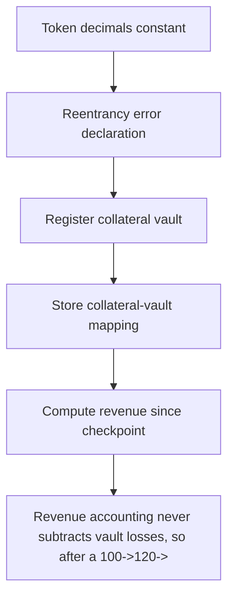

# Tenbin: Revenue accounting never subtracts vault losses

> **Vulnerability classes:** vuln/theft · vuln/locked-funds · vuln/reward-accounting
>
> **Reproduction:** a faithful minimal reproduction of the vulnerable finding — the vulnerable function is reproduced **verbatim** (marked `@>`) with faithful minimal doubles; local deploy, no fork.

<!-- source-auditvault: https://github.com/Auditware/AuditVault/blob/main/findings/64974-revenue-accounting-ignores-losses-spearbit-none-tenbin-pdf.md -->

## Root cause

Revenue accounting never subtracts vault losses, so after a 100->120->105 gain-then-loss the stale pendingRevenue (20) exceeds true net yield (5); withdrawRevenue(20) pays out the full stale figure, draining 15 units of manager principal collateral to the collector (sink) as fake revenue.

```solidity

    function _realizeRevenue(address collateral, IERC4626 vault) internal {
        uint256 newRevenue = _computeNewRevenue(collateral, vault);
        if (newRevenue > 0) pendingRevenue[collateral] += newRevenue; // @> only positive deltas booked; a totalAssets loss is never subtracted from pendingRevenue
    }

```

## Why it's exploitable here

Revenue accounting never subtracts vault losses, so after a 100->120->105 gain-then-loss the stale pendingRevenue (20) exceeds true net yield (5); withdrawRevenue(20) pays out the full stale figure, draining 15 units of manager principal collateral to the collector (sink) as fake revenue.

## Attack path



## Marked-line walkthrough (Playground)

The EVM Playground pins each step to the exact executed source line in `0xce01759b82…`:

1. **L46** — Token decimals constant: Setup: declares the token's 18 decimals.
2. **L111** — Reentrancy error declaration: Setup: custom error used by the contract's reentrancy guard.
3. **L140** — Register collateral vault: Setup: links a collateral token to its yield-bearing ERC4626 vault.
4. **L141** — Store collateral-vault mapping: Setup: records the vault used to measure that collateral's yield.
5. **L157** — Compute revenue since checkpoint: Measures yield gained since the last checkpoint — a positive-only figure that ignores any drop in the vault's value.
6. **L158** — Add gains, never subtract losses: Only ever ADDS positive revenue and never subtracts vault losses, so `pendingRevenue` ratchets up and stays stale above true net yield.
7. **L169** — Withdraw guard uses stale total: The only withdraw check compares against the inflated `pendingRevenue`, so a withdrawal of fake revenue passes and drains manager principal.

## PoC

Registry (Foundry, local deploy — verbatim vulnerable source + harm-asserting test + negative control):

```bash
cd 64974-revenue-accounting-ignores-losses-spearbit-none-tenbin-pdf_exp
forge test -vvv
```

The browser Playground replays the same synthetic opcode-for-opcode and measures the harm: **Revenue accounting never subtracts vault losses, so after a 100->120->105 gain-then-loss the stale pendingRevenue (20) exceeds true net yiel**. Both gates are green (registry `forge test` PASS + Playground `_verify-poc` **VERDICT: PASS**).
