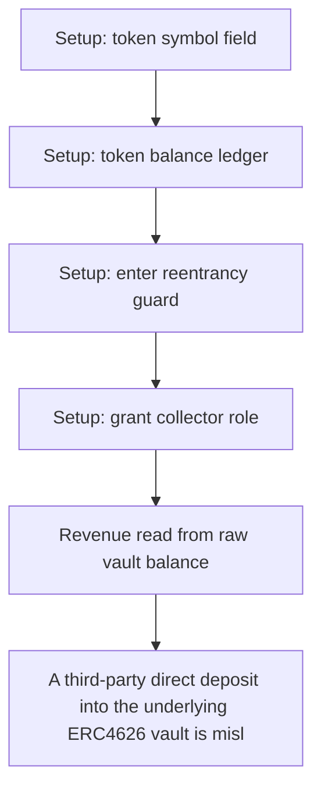

# Tenbin: A third-party direct deposit into the underlying ERC4626 vault is mislabeled as protocol r

> **Vulnerability classes:** vuln/theft · vuln/reward-accounting
>
> **Reproduction:** a faithful minimal reproduction of the vulnerable finding — the vulnerable function is reproduced **verbatim** (marked `@>`) with faithful minimal doubles; local deploy, no fork.

<!-- source-auditvault: https://github.com/Auditware/AuditVault/blob/main/findings/64975-direct-vault-deposits-incorrectly-counted-as-revenue-leading.md -->

## Root cause

A third-party direct deposit into the underlying ERC4626 vault is mislabeled as protocol revenue by _computeNewRevenue; the collector withdraws it, draining 1000 collateral of the manager's own principal to the collector sink while true protocol yield is 0.

```solidity
    }

    // ── VERBATIM vulnerable code ────────────────────────────────────────────
    function _computeNewRevenue(address collateral, IERC4626 vault) internal view returns (uint256 revenue) {
        uint256 totalAssets = vault.totalAssets(); // @> counts third-party deposits as protocol revenue (uses raw vault totalAssets, not protocol-owned share value)
        uint256 lastTotal = lastTotalAssets[collateral];
```

## Why it's exploitable here

A third-party direct deposit into the underlying ERC4626 vault is mislabeled as protocol revenue by _computeNewRevenue; the collector withdraws it, draining 1000 collateral of the manager's own principal to the collector sink while true protocol yield is 0.

## Attack path



## Marked-line walkthrough (Playground)

The EVM Playground pins each step to the exact executed source line in `0xce01759b82…`:

1. **L53** — Setup: token symbol field: Setup: declares the mock collateral token's `symbol`; harness scaffolding with no role in the exploit.
2. **L56** — Setup: token balance ledger: Setup: the mock ERC20's `balanceOf` mapping, used to fund the manager and vault before the drain.
3. **L147** — Setup: enter reentrancy guard: Setup: sets the reentrancy-guard slot to the entered state; wiring on the withdraw path, not the bug.
4. **L184** — Setup: grant collector role: Setup: grants `COLLECTOR_ROLE` to the account that will later pull the mislabeled revenue out as real funds.
5. **L200** — Revenue read from raw vault balance: Root-cause bug: `_computeNewRevenue` treats the underlying vault's asset balance as profit, so a stranger's direct deposit is booked as protocol revenue.
6. **L215** — Collector withdraws phantom revenue: `withdrawRevenue`, gated only by `COLLECTOR_ROLE`, lets the collector pull the falsely-counted revenue out as the manager's own principal.
7. **L222** — Cap check against inflated total: The only guard checks `amount` against `totalRevenue`, which the direct deposit already inflated, so the 1000-collateral drain passes.

## PoC

Registry (Foundry, local deploy — verbatim vulnerable source + harm-asserting test + negative control):

```bash
cd 64975-direct-vault-deposits-incorrectly-counted-as-revenue-leading_exp
forge test -vvv
```

The browser Playground replays the same synthetic opcode-for-opcode and measures the harm: **A third-party direct deposit into the underlying ERC4626 vault is mislabeled as protocol revenue by _computeNewRevenue; the collector withdr**. Both gates are green (registry `forge test` PASS + Playground `_verify-poc` **VERDICT: PASS**).
