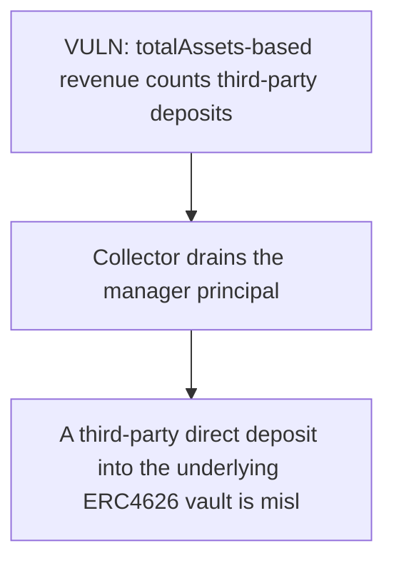

# Tenbin: A third-party direct deposit into the underlying ERC4626 vault is mislabeled as protocol r

> **Vulnerability classes:** vuln/theft · vuln/reward-accounting
>
> **Reproduction:** a faithful minimal reproduction of the vulnerable finding — the vulnerable function is reproduced **verbatim** (marked `@>`) with faithful minimal doubles; local deploy, no fork.

<!-- source-auditvault: https://github.com/Auditware/AuditVault/blob/main/findings/64975-direct-vault-deposits-incorrectly-counted-as-revenue-leading.md -->

## Root cause

A third-party direct deposit into the underlying ERC4626 vault is mislabeled as protocol revenue by _computeNewRevenue; the collector withdraws it, draining 1000 collateral of the manager's own principal to the collector sink while true protocol yield is 0.

```solidity
    }

    // ── VERBATIM vulnerable code ────────────────────────────────────────────
    function _computeNewRevenue(address collateral, IERC4626 vault) internal view returns (uint256 revenue) {
        uint256 totalAssets = vault.totalAssets(); // @> counts third-party deposits as protocol revenue (uses raw vault totalAssets, not protocol-owned share value)
        uint256 lastTotal = lastTotalAssets[collateral];
```

## Why it's exploitable here

A third-party direct deposit into the underlying ERC4626 vault is mislabeled as protocol revenue by _computeNewRevenue; the collector withdraws it, draining 1000 collateral of the manager's own principal to the collector sink while true protocol yield is 0.

## Attack path



## Marked-line walkthrough (Playground)

The EVM Playground pins each step to the exact executed source line in `0xce01759b82…`:

1. **L200** — VULN: totalAssets-based revenue counts third-party deposits: The manager treats any rise in vault.totalAssets() as protocol revenue, so a third party depositing D inflates the recorded revenue even though the protocol earned nothing.
2. **L215** — Collector drains the manager principal: withdrawRevenue then transfers D of the manager's OWN collateral principal out as fake revenue.

## PoC

Registry (Foundry, local deploy — verbatim vulnerable source + harm-asserting test + negative control):

```bash
cd 64975-direct-vault-deposits-incorrectly-counted-as-revenue-leading_exp
forge test -vvv
```

The browser Playground replays the same synthetic opcode-for-opcode and measures the harm: **A third-party direct deposit into the underlying ERC4626 vault is mislabeled as protocol revenue by _computeNewRevenue; the collector withdr**. Both gates are green (registry `forge test` PASS + Playground `_verify-poc` **VERDICT: PASS**).
