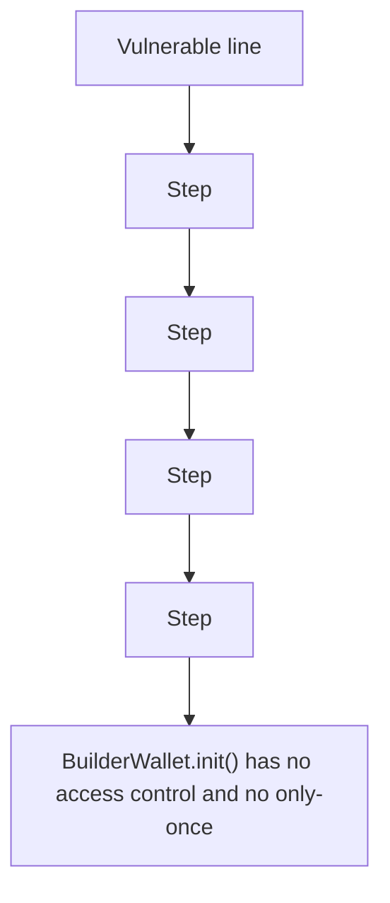

# Panoptic: BuilderWallet init() is unprotected and re-initializable

> **Vulnerability classes:** vuln/logic
>
> **Reproduction:** a faithful minimal reproduction of the vulnerable finding — the vulnerable code is reproduced **verbatim** (marked `@>`) with faithful minimal doubles; local deploy, no fork.

<!-- source-auditvault: https://github.com/code-423n4/2025-12-panoptic/blob/a4361d6d8dc6420c09187d80ea1a7ce851d1ca36/contracts/RiskEngine.sol# -->

## Root cause

BuilderWallet.init() has no access control and no only-once guard, so an attacker re-calls init(attacker) to overwrite builderAdmin, then passes sweep()'s msg.sender==builderAdmin check and transfers out the wallet's entire ERC20 balance - draining 500e18 of protocol-distributed builder fees to the attacker.

```solidity
    function init(address _builderAdmin) external { // @> VULN (this line)
```

## Why it's exploitable here

BuilderWallet.init() has no access control and no only-once guard, so an attacker re-calls init(attacker) to overwrite builderAdmin, then passes sweep()'s msg.sender==builderAdmin check and transfers out the wallet's entire ERC20 balance - draining 500e18 of protocol-distributed builder fees to the attacker.

## Attack path



## Marked-line walkthrough (Playground)

The EVM Playground pins each step to the exact executed source line in `0x671d353a77…`:

1. **L68** — Vulnerable line: Executes `bool ok = IERC20(token).transfer(to, bal);`
2. **L69** — Step: Executes `if (!ok) {`
3. **L71** — Step: Executes `revert Errors.TransferFailed(token, address(this), bal, bal);`
4. **L79** — Step: Executes `string public name = 'Panoptic Builder Fee Token';`
5. **L82** — Step: Executes `uint256 public totalSupply;`
6. **L84** — Step: Executes `mapping(address => mapping(address => uint256)) public allowance;`

## PoC

Registry (Foundry, local deploy — verbatim vulnerable source + harm-asserting test):

```bash
cd 65025-h-01-builderwallet-init-is-unprotectedre-initializable-enabl_exp
forge test -vvv
```

The browser Playground replays the same synthetic opcode-for-opcode and measures the harm. Both gates are green (registry `forge test` PASS + Playground `_verify-poc` **VERDICT: PASS**).
