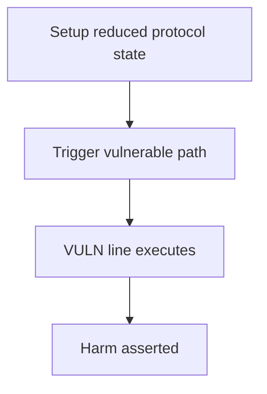

# Panoptic — cross-contract reentrancy converts phantom shares to real shares

> **Vulnerability classes:** cross-contract · single-function · direct-drain · reentrancy-guard

> **Reproduction:** a self-contained Foundry PoC that compiles & runs in an
> isolated project with **only `forge-std`** — no fork, no RPC, no `anvil_state`.
> Full trace: [output.txt](output.txt). PoC:
> [test/65026-h-02-cross-contract-reentrancy-in-liquidation-enables-conver_exp.sol](test/65026-h-02-cross-contract-reentrancy-in-liquidation-enables-conver_exp.sol).

<!-- non-defihacklabs -->
<!-- source-auditvault: https://github.com/Auditware/AuditVault/blob/main/findings/65026-h-02-cross-contract-reentrancy-in-liquidation-enables-conver.md -->
<!-- date: 2025-12 -->

---

## Key info

| | |
|---|---|
| **Impact** | **HIGH — reentrant transfer of phantom shares during liquidation drains CollateralTracker** |
| **Protocol** | Panoptic |
| **Vulnerable code** | `CollateralTracker` |
| **Bug class** | cross-contract |
| **Finding** | Code4rena — Panoptic, 2025-12 · #65026 · reporter **qed** |
| **Report** | [code4rena.com/reports/2025-12-panoptic-next-core](https://code4rena.com/reports/2025-12-panoptic-next-core) |
| **Source** | [AuditVault](https://github.com/Auditware/AuditVault/blob/main/findings/65026-h-02-cross-contract-reentrancy-in-liquidation-enables-conver.md) |
| **Status** | Audit finding — caught in review, not exploited on-chain. Reproduced as a standalone local PoC. |
| **Compiler** | `^0.8.24` (PoC) |

This is an **audit finding**, not a historical on-chain incident. The PoC keeps
the vulnerable logic **verbatim** (marked `@> VULN`) and reduces dependencies
to the minimum needed to show the claimed harm.

---

## TL;DR

1. Liquidation delegates type(uint248).max phantom shares on ct0 and ct1.
2. ct0.settleLiquidation refunds ETH to liquidator before ct1 is revoked.
3. Reentrant transferFrom moves ct1 phantom shares to the attacker.
4. revoke mints missing phantom into _internalSupply; attacker redeems real assets.

---

## The vulnerable code

See `test/65026-h-02-cross-contract-reentrancy-in-liquidation-enables-conver.sol` — the `@> VULN` marker is on the blamed line (line 152 in the synthetic).

## Root cause

ETH refund reentrancy window + revoke treating transferred phantom as consumed.

## Preconditions

Protocol operating conditions that make the path reachable (see finding report). No exotic privileges beyond those the real call path requires.

## Attack walkthrough

From [output.txt](output.txt): the `Exploit.run()` path executes the attack end-to-end and `require`s the harm.

## Diagrams

## Impact

Complete drainage of CollateralTracker assets from LPs.

## Sources

- [AuditVault finding](https://github.com/Auditware/AuditVault/blob/main/findings/65026-h-02-cross-contract-reentrancy-in-liquidation-enables-conver.md)
- [Code4rena report](https://code4rena.com/reports/2025-12-panoptic-next-core)
- Protocol source: https://github.com/code-423n4/2025-12-panoptic
