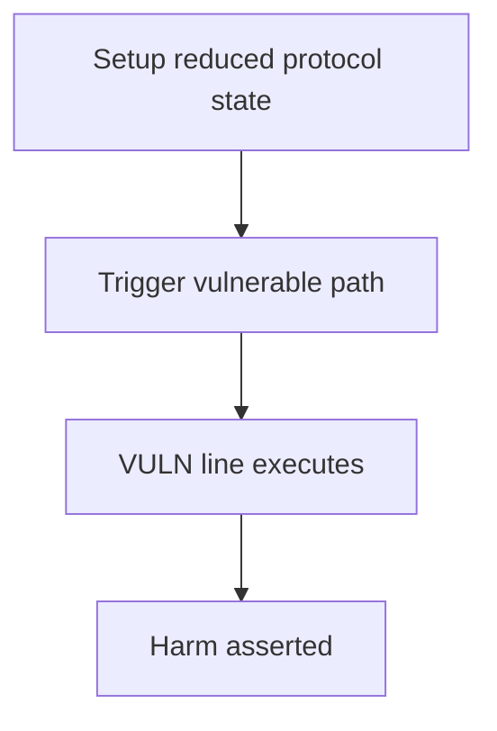

# Panoptic — commission fees can always be bypassed

> **Vulnerability classes:** fee-calculation · fee-theft · variant · fee-accounting

> **Reproduction:** a self-contained Foundry PoC that compiles & runs in an
> isolated project with **only `forge-std`** — no fork, no RPC, no `anvil_state`.
> Full trace: [output.txt](output.txt). PoC:
> [test/65027-h-03-commission-fees-can-always-be-bypassed-code4rena-panopt_exp.sol](test/65027-h-03-commission-fees-can-always-be-bypassed-code4rena-panopt_exp.sol).

<!-- non-defihacklabs -->
<!-- source-auditvault: https://github.com/Auditware/AuditVault/blob/main/findings/65027-h-03-commission-fees-can-always-be-bypassed-code4rena-panopt.md -->
<!-- date: 2025-12 -->

---

## Key info

| | |
|---|---|
| **Impact** | **HIGH — settle-premium then burn pays zero commission while honest burn would pay** |
| **Protocol** | Panoptic |
| **Vulnerable code** | `CollateralTracker` |
| **Bug class** | fee-calculation |
| **Finding** | Code4rena — Panoptic, 2025-12 · #65027 · reporter **prk0** |
| **Report** | [code4rena.com/reports/2025-12-panoptic-next-core](https://code4rena.com/reports/2025-12-panoptic-next-core) |
| **Source** | [AuditVault](https://github.com/Auditware/AuditVault/blob/main/findings/65027-h-03-commission-fees-can-always-be-bypassed-code4rena-panopt.md) |
| **Status** | Audit finding — caught in review, not exploited on-chain. Reproduced as a standalone local PoC. |
| **Compiler** | `^0.8.24` (PoC) |

This is an **audit finding**, not a historical on-chain incident. The PoC keeps
the vulnerable logic **verbatim** (marked `@> VULN`) and reduces dependencies
to the minimum needed to show the claimed harm.

---

## TL;DR

1. settleBurn takes commission = min(premiumFee, notionalFee).
2. _settleOptions passes long=short=amm=0 so notionalFee = 0 → commission 0.
3. If realizedPremium == 0 the whole fee block is skipped.
4. User settles premium first, then burns, and pays nothing.

---

## The vulnerable code

See `test/65027-h-03-commission-fees-can-always-be-bypassed-code4rena-panopt.sol` — the `@> VULN` marker is on the blamed line (line 110 in the synthetic).

## Root cause

min(premium, notional) with zero notional on settle path; gate on realizedPremium != 0.

## Preconditions

Protocol operating conditions that make the path reachable (see finding report). No exotic privileges beyond those the real call path requires.

## Attack walkthrough

From [output.txt](output.txt): the `Exploit.run()` path executes the attack end-to-end and `require`s the harm.

## Diagrams

## Impact

Protocol commission revenue fully avoidable on exit.

## Sources

- [AuditVault finding](https://github.com/Auditware/AuditVault/blob/main/findings/65027-h-03-commission-fees-can-always-be-bypassed-code4rena-panopt.md)
- [Code4rena report](https://code4rena.com/reports/2025-12-panoptic-next-core)
- Protocol source: https://github.com/code-423n4/2025-12-panoptic
