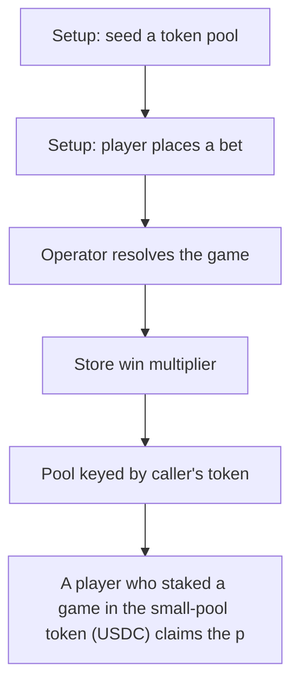

# Abster Freefall: A player who staked a game in the small-pool token (USDC) claims the payout out of the lar

> **Vulnerability classes:** vuln/theft · vuln/locked-funds
>
> **Reproduction:** a faithful minimal reproduction of the vulnerable finding — the vulnerable function is reproduced **verbatim** (marked `@>`) with faithful minimal doubles; local deploy, no fork.

<!-- source-auditvault: https://github.com/Auditware/AuditVault/blob/main/findings/65079-h-01-claim-allows-payouts-from-an-arbitrary-token-pool-not-t.md -->

## Root cause

A player who staked a game in the small-pool token (USDC) claims the payout out of the large-pool token (WETH) — Freefall.claim reads the pool and pays from the caller-supplied _tokenAddress without checking it equals game.tokenAddress — draining 100 WETH (the entire pool) to the attacker EOA who never wagered WETH.

```solidity

    // ─── verbatim vulnerable claim() core (finding 65079, Freefall.sol#L219) ───
    function claim(address _tokenAddress, string calldata _gameId) external {
        Pool storage pool = liquidityPool[_tokenAddress]; // @> pool chosen from caller-supplied _tokenAddress, never checked == game.tokenAddress
        uint256 onChainGameId = offChainGameIdToOnChainGameId[_gameId];
        Game storage game = games[onChainGameId];
```

## Why it's exploitable here

A player who staked a game in the small-pool token (USDC) claims the payout out of the large-pool token (WETH) — Freefall.claim reads the pool and pays from the caller-supplied _tokenAddress without checking it equals game.tokenAddress — draining 100 WETH (the entire pool) to the attacker EOA who never wagered WETH.

## Attack path



## Marked-line walkthrough (Playground)

The EVM Playground pins each step to the exact executed source line in `0xce01759b82…`:

1. **L95** — Setup: seed a token pool: Setup: a liquidity provider funds the pool by transferring `amount` of `_tokenAddress` into the contract (e.g. 100 WETH).
2. **L104** — Setup: player places a bet: Setup: the player stakes `betAmount` of the game's own token (USDC), recording the wager they will later claim on.
3. **L119** — Operator resolves the game: Setup: `resolve` finalizes the round, recording the win multiplier before the player is allowed to claim.
4. **L121** — Store win multiplier: Saves `determinedMultiplier` for the game; this scales the payout the attacker will withdraw from the wrong pool.
5. **L126** — Pool keyed by caller's token: Root-cause bug: `claim` loads the pool for the caller-supplied `_tokenAddress`, never checking it equals `game.tokenAddress`, so any pool can be drained.
6. **L131** — Compute payout amount: Payout is `betAmount * multiplier`, but it is paid from the attacker-chosen pool token, not the token actually wagered.
7. **L147** — Fixed contract for comparison: Setup: `FreefallFixed` is the corrected variant that binds the payout token to the game's staked token.

## PoC

Registry (Foundry, local deploy — verbatim vulnerable source + harm-asserting test + negative control):

```bash
cd 65079-h-01-claim-allows-payouts-from-an-arbitrary-token-pool-not-t_exp
forge test -vvv
```

The browser Playground replays the same synthetic opcode-for-opcode and measures the harm: **A player who staked a game in the small-pool token (USDC) claims the payout out of the large-pool token (WETH) — Freefall.claim reads the po**. Both gates are green (registry `forge test` PASS + Playground `_verify-poc` **VERDICT: PASS**).
