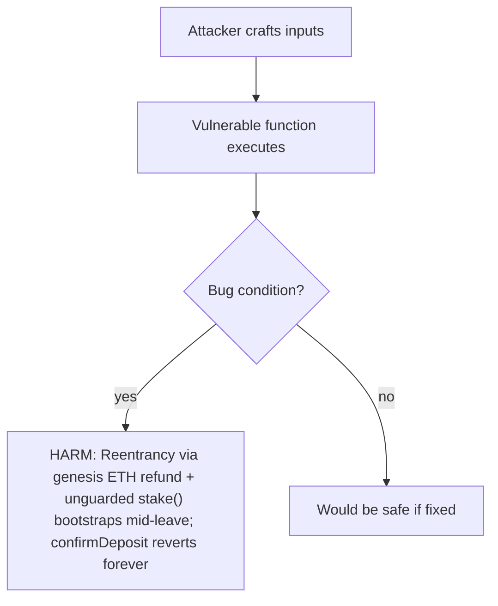
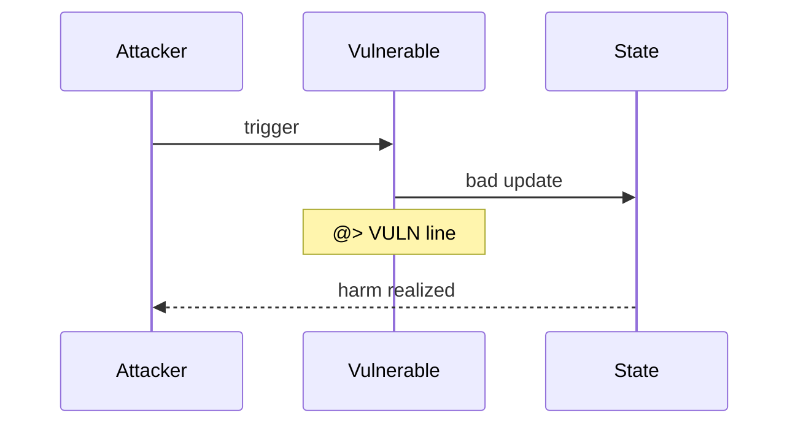

# Recall — [H-06] Reentrancy in leave() leads to halting of bottom-up checkpoints

> **Vulnerability classes:** severity/high · platform/code4rena · sector/staking · sector/governance
>
> **Reproduction:** self-contained Foundry PoC with only `forge-std` — no fork, no RPC.
> Full trace: [output.txt](output.txt).

<!-- non-defihacklabs -->
<!-- source-auditvault: https://github.com/Auditware/AuditVault/blob/main/findings/65093-h-06-reentrancy-in-function.md -->
<!-- date: 2025-02 -->

**AuditVault taxonomy:** `lang/solidity` · `platform/code4rena` · `has/poc` · `severity/high` · protocol Recall

---

## Key info

| | |
|---|---|
| **Impact** | **HIGH** — Reentrancy via genesis ETH refund + unguarded stake() bootstraps mid-leave; confirmDeposit reverts forever |
| **Protocol** | [Recall](https://code4rena.com/reports/2025-02-recall) (IPC / subnet actor) |
| **Finding** | Code4rena 2025-02-recall · #65093 |
| **Report** | [2025-02-recall](https://code4rena.com/reports/2025-02-recall) |
| **Source** | [AuditVault](https://github.com/Auditware/AuditVault/blob/main/findings/65093-h-06-reentrancy-in-function.md) |
| **Compiler** | `^0.8.24` (PoC) |

---

## TL;DR

Reentrancy via genesis ETH refund + unguarded stake() bootstraps mid-leave; confirmDeposit reverts forever

---

## The vulnerable code

```solidity
(bool success, ) = payable(msg.sender).call{value: genesisBal}(""); // @> VULN
```

**Fix:** CEI; nonReentrant on stake/join; re-check !bootstrapped after external calls.

---

## Root cause

See vulnerable line above. Reduced synthetic preserves the blamed statement verbatim (`@> VULN`).

---

## Preconditions

- Audited Recall / IPC contracts at contest commit `ab5f90b9`.
- Attack path as described in the Code4rena report.

---

## Attack walkthrough

1. Deploy the synthetic vulnerable surface.
2. Execute the attack in `Exploit.run()`.
3. Assert the report's concrete harm (funds / liveness / forged consensus).

---

## Diagrams





## Remediation

CEI; nonReentrant on stake/join; re-check !bootstrapped after external calls.

---

## Sources

- [AuditVault finding](https://github.com/Auditware/AuditVault/blob/main/findings/65093-h-06-reentrancy-in-function.md)
- [Code4rena report 2025-02-recall](https://code4rena.com/reports/2025-02-recall)
- Reduced source: [code-423n4/2025-02-recall@ab5f90b9](https://github.com/code-423n4/2025-02-recall/tree/ab5f90b9b0322016ecce6dd71c528a935544bec5)
