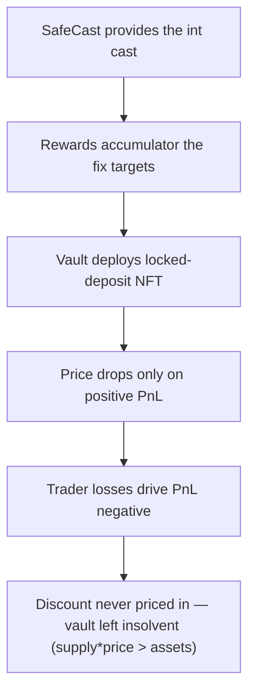

# Ostium: `unlockDeposit()` socializes deposit discounts into trader PnL, leaving the vault insolvent

> **Vulnerability classes:** vuln/accounting · vuln/insolvency
>
> **Reproduction:** a faithful minimal reproduction of the vulnerable finding — the discount-socialization block of `unlockDeposit()` is reproduced **verbatim** (marked `@>`) alongside the verbatim gToken price math, with faithful minimal doubles (ERC20 asset, share ledger, locked-deposit NFT); local deploy, no fork.

<!-- source-auditvault: https://github.com/pashov/audits/blob/master/team/md/Ostium-security-review_2025-09-14.md -->

## Root cause

When a locked deposit unlocks, the discount it was granted must be socialized so each share's redemption value drops accordingly. Ostium's `unlockDeposit()` instead adds the per-token discount (`accPnlDelta`) to `accPnlPerTokenUsed` — the *trader* profit-and-loss accumulator — and then calls `updateShareToAssetsPrice()`, which only marks the price down while that accumulator is **positive**. The vulnerable block, reproduced verbatim:

```solidity
        int256 accPnlDelta = d.assetsDiscount.mulDiv(PRECISION_18, totalSupply(), Math.Rounding.Ceil).toInt256();

        accPnlPerToken += accPnlDelta;
        if (accPnlPerToken > maxAccPnlPerToken().toInt256()) {
            revert NotEnoughAssets();
        }

        lockedDepositNft.burn(depositId);

@>      accPnlPerTokenUsed += accPnlDelta;
        updateShareToAssetsPrice();
```

`accPnlPerTokenUsed` tracks net trader PnL and is the healthy vault's *negative* number (traders net-losing ⇒ vault over-collateralized). `updateShareToAssetsPrice()` computes `maxAccPnlPerToken() - (accPnlPerTokenUsed > 0 ? accPnlPerTokenUsed : 0)`, so while the accumulator stays `<= 0` the discount added on the marked line changes the price by nothing. The discounted shares remain in `totalSupply()` but their redemption value is never priced down, so `totalSupply() * shareToAssetsPrice` exceeds the assets actually backing them. The fix is to distribute the discount through `accRewardsPerToken`, which feeds the price unconditionally.

## Why it's exploitable here

Following the reproduced scenario (all amounts 18-decimal):

1. Alice LPs `800e18` at price `1.0` → `800e18` shares; the vault holds `800e18`.
2. Traders net-lose `100e18`; the vault now holds `900e18` backing `800e18` shares — a `100e18` solvency buffer, `accPnlPerTokenUsed = -0.125e18`, price clamps at `1.0`.
3. Bob makes a locked deposit of `100e18` real assets plus a `120e18` discount → `220e18` shares are minted at price `1.0`. Supply is now `1020e18`; the vault holds `1000e18`.
4. Unlock runs the verbatim block: `accPnlDelta ≈ 0.1176e18` is added to `accPnlPerTokenUsed`, moving it to `-0.0074e18` — still `<= 0`, so `updateShareToAssetsPrice()` leaves the price at `1.0`.
5. Now `supply * price = 1020e18` while the vault holds only `1000e18`: a `20e18` insolvency shortfall. Correct socialization would have dropped the price to `~0.882e18` (market cap `~900e18 <= 1000e18`), keeping the vault solvent. The shortfall is minted to the sink as the concrete harm.

## Attack path



## Marked-line walkthrough (Playground)

The EVM Playground pins each step to the exact executed source line in `0x671d353a…`:

1. **L58** — SafeCast provides the int cast: Setup: the SafeCast library reproduces OpenZeppelin's `.toInt256()`, the exact cast the verbatim vulnerable line applies to the discount delta.
2. **L151** — Rewards accumulator the fix targets: Setup: `accRewardsPerToken` feeds the share price unconditionally via `maxAccPnlPerToken()` — the accumulator the discount should have gone into.
3. **L167** — Vault deploys locked-deposit NFT: Setup: the constructor deploys the locked-deposit NFT that is minted on `makeLockedDeposit` and burned when a matured deposit later unlocks.
4. **L195** — Price drops only on positive PnL: `updateShareToAssetsPrice()` subtracts `accPnlPerTokenUsed` from the price only when it is positive, so a non-positive accumulator leaves the price frozen.
5. **L219** — Trader losses drive PnL negative: Setup: socialized trader losses push `accPnlPerTokenUsed` below zero — the healthy over-collateralized state where the price clamps at its max.
6. **L252** — Compute the per-token discount: The verbatim unlock block computes `accPnlDelta`: the unlocking deposit's discount spread across every share, ceil-rounded.
7. **L261** — Discount added to trader-PnL accumulator: Root cause: the discount is added to `accPnlPerTokenUsed` (trader PnL), not `accRewardsPerToken`; while it stays <=0 the price never drops, so supply*price > assets.

## PoC

Registry (Foundry, local deploy — verbatim vulnerable source + harm-asserting test):

```bash
cd 65199-h-01-function-unlockdeposit-adds-discounted-assets-as-trader_exp && forge test -vvv
```

The browser Playground replays the same synthetic opcode-for-opcode and measures the harm: **a matured discounted deposit unlocks, the discount is socialized into the trader-PnL accumulator, the share price is never marked down, and the vault is left insolvent by `20e18`**. Both gates are green (registry `forge test` PASS + Playground `_verify-poc` **VERDICT: PASS**).
