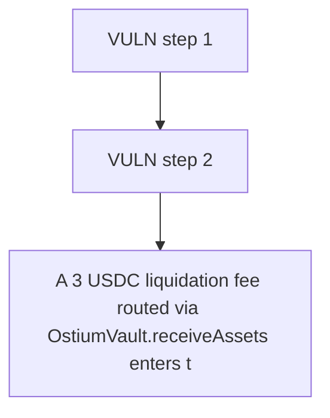

# Ostium: A 3 USDC liquidation fee routed via OstiumVault.receiveAssets enters the vault's USDC bala

> **Vulnerability classes:** vuln/locked-funds · vuln/reward-accounting · vuln/price
>
> **Reproduction:** a faithful minimal reproduction of the vulnerable finding — the vulnerable function is reproduced **verbatim** (marked `@>`) with faithful minimal doubles; local deploy, no fork.

<!-- source-auditvault: https://github.com/Auditware/AuditVault/blob/main/findings/65201-h-03-lp-providers-will-not-get-liquidation-fee-most-times-pa.md -->

## Root cause

A 3 USDC liquidation fee routed via OstiumVault.receiveAssets enters the vault's USDC balance but sinks into accPnlPerToken with no share-price update; when net trader PnL is negative the clamp in updateShareToAssetsPrice() neutralizes it, so the sole LP's claimable value stays flat (0 delta) while the fixed reward path raises it by the full 3 USDC — 3 LOCKED-USDC of LP reward is stuck/unclaimable

```solidity
        dailyAccPnlDeltaPerToken -= accPnlDelta;
        totalClosedPnl -= assets.toInt256();

        // [dropped: tryResetDailyAccPnlDelta(); tryNewSettlement();]
        emit AssetsReceived(sender, user, assets);
    }
```

## Why it's exploitable here

A 3 USDC liquidation fee routed via OstiumVault.receiveAssets enters the vault's USDC balance but sinks into accPnlPerToken with no share-price update; when net trader PnL is negative the clamp in updateShareToAssetsPrice() neutralizes it, so the sole LP's claimable value stays flat (0 delta) while the fixed reward path raises it by the full 3 USDC — 3 LOCKED-USDC of LP reward is stuck/unclaimable.

## Attack path



## Marked-line walkthrough (Playground)

The EVM Playground pins each step to the exact executed source line in `0x671d353a77…`:

1. **L219** — VULN step 1: liquidation fee sunk into accPnlPerToken (not accRewardsPerToken) with no share-price update; when trader net PnL is negative the clamp in updateShareToAssetsPrice() neutralizes it, so the LP share pr
2. **L220** — VULN step 2: liquidation fee sunk into accPnlPerToken (not accRewardsPerToken) with no share-price update; when trader net PnL is negative the clamp in updateShareToAssetsPrice() neutralizes it, so the LP share pr

## PoC

Registry (Foundry, local deploy — verbatim vulnerable source + harm-asserting test + negative control):

```bash
cd 65201-h-03-lp-providers-will-not-get-liquidation-fee-most-times-pa_exp
forge test -vvv
```

The browser Playground replays the same synthetic opcode-for-opcode and measures the harm: **A 3 USDC liquidation fee routed via OstiumVault.receiveAssets enters the vault's USDC balance but sinks into accPnlPerToken with no share-pr**. Both gates are green (registry `forge test` PASS + Playground `_verify-poc` **VERDICT: PASS**).
