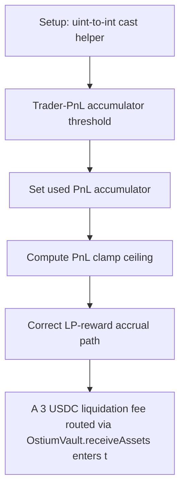

# Ostium: A 3 USDC liquidation fee routed via OstiumVault.receiveAssets enters the vault's USDC bala

> **Vulnerability classes:** vuln/locked-funds · vuln/reward-accounting · vuln/price
>
> **Reproduction:** a faithful minimal reproduction of the vulnerable finding — the vulnerable function is reproduced **verbatim** (marked `@>`) with faithful minimal doubles; local deploy, no fork.

<!-- source-auditvault: https://github.com/Auditware/AuditVault/blob/main/findings/65201-h-03-lp-providers-will-not-get-liquidation-fee-most-times-pa.md -->

## Root cause

A 3 USDC liquidation fee routed via OstiumVault.receiveAssets enters the vault's USDC balance but sinks into accPnlPerToken with no share-price update; when net trader PnL is negative the clamp in updateShareToAssetsPrice() neutralizes it, so the sole LP's claimable value stays flat (0 delta) while the fixed reward path raises it by the full 3 USDC — 3 LOCKED-USDC of LP reward is stuck/unclaimable

```solidity
        dailyAccPnlDeltaPerToken -= accPnlDelta;
        totalClosedPnl -= assets.toInt256();

        // [dropped: tryResetDailyAccPnlDelta(); tryNewSettlement();]
        emit AssetsReceived(sender, user, assets);
    }
```

## Why it's exploitable here

A 3 USDC liquidation fee routed via OstiumVault.receiveAssets enters the vault's USDC balance but sinks into accPnlPerToken with no share-price update; when net trader PnL is negative the clamp in updateShareToAssetsPrice() neutralizes it, so the sole LP's claimable value stays flat (0 delta) while the fixed reward path raises it by the full 3 USDC — 3 LOCKED-USDC of LP reward is stuck/unclaimable.

## Attack path



## Marked-line walkthrough (Playground)

The EVM Playground pins each step to the exact executed source line in `0x671d353a77…`:

1. **L68** — Setup: uint-to-int cast helper: Setup: `toInt256` casts unsigned amounts to signed for the PnL accounting; a helper, not the bug.
2. **L132** — Trader-PnL accumulator threshold: Declares `accPnlPerTokenThreshold`, the signed PnL accumulator into which the liquidation fee is wrongly folded instead of LP rewards.
3. **L166** — Set used PnL accumulator: Stores `accPnlPerTokenUsed`, the value the share-price clamp reads when deciding whether the routed fee lifts LP value.
4. **L174** — Compute PnL clamp ceiling: `maxAccPnlPerToken` gives the cap that neutralizes the routed fee when net trader PnL is negative, so LP value stays flat.
5. **L202** — Correct LP-reward accrual path: The fixed path credits the fee into `accRewardsPerToken`, raising every LP's claimable value — the accumulator the buggy route skips.
6. **L220** — Fee enters vault as PnL: `receiveAssets` emits after depositing the 3 USDC fee into the PnL accumulator, so no share-price update ever rewards the LP.
7. **L232** — Convert shares to LP assets: `convertToAssets` computes LP claimable value, which stays flat because the fee never lifted the share price.

## PoC

Registry (Foundry, local deploy — verbatim vulnerable source + harm-asserting test + negative control):

```bash
cd 65201-h-03-lp-providers-will-not-get-liquidation-fee-most-times-pa_exp
forge test -vvv
```

The browser Playground replays the same synthetic opcode-for-opcode and measures the harm: **A 3 USDC liquidation fee routed via OstiumVault.receiveAssets enters the vault's USDC balance but sinks into accPnlPerToken with no share-pr**. Both gates are green (registry `forge test` PASS + Playground `_verify-poc` **VERDICT: PASS**).
