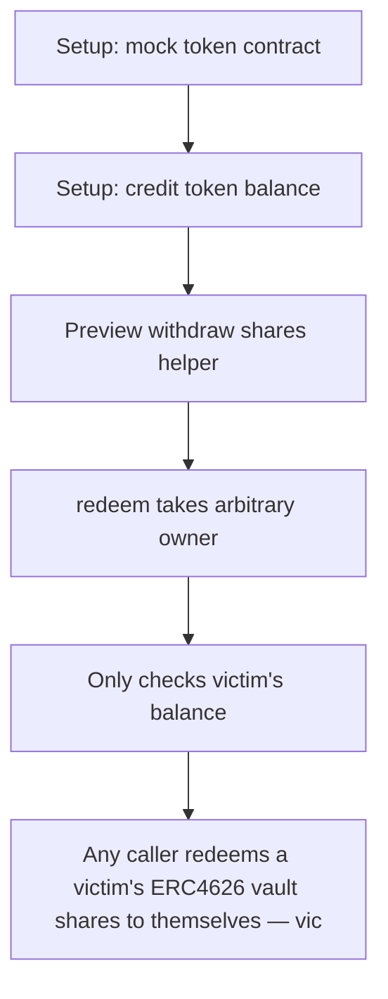

# Pear: Any caller redeems a victim's ERC4626 vault shares to themselves — victim's 1000e18 shares

> **Vulnerability classes:** vuln/theft
>
> **Reproduction:** a faithful minimal reproduction of the vulnerable finding — the vulnerable function is reproduced **verbatim** (marked `@>`) with faithful minimal doubles; local deploy, no fork.

<!-- source-auditvault: https://github.com/Auditware/AuditVault/blob/main/findings/65286-c-01-missing-authorization-in-withdraw-and-redeem-allows-the.md -->

## Root cause

Any caller redeems a victim's ERC4626 vault shares to themselves — victim's 1000e18 shares are burned to 0 and 1000e18 underlying is transferred to the attacker EOA, draining all depositors.

```solidity
    function _withdrawWithFee(uint256 shares, address user, address receiver) internal returns (uint256) {
        // code
        uint256 assetsToTransfer = super.previewRedeem(shares); // fee == 0 -> full asset value
        super._withdraw(
            user, // @> caller (same as owner to avoid allowance check) -> super._withdraw skips _spendAllowance, so ANY attacker may pass a victim as `user`
            receiver, // receiver
```

## Why it's exploitable here

Any caller redeems a victim's ERC4626 vault shares to themselves — victim's 1000e18 shares are burned to 0 and 1000e18 underlying is transferred to the attacker EOA, draining all depositors.

## Attack path



## Marked-line walkthrough (Playground)

The EVM Playground pins each step to the exact executed source line in `0x671d353a77…`:

1. **L41** — Setup: mock token contract: Setup: `MiniToken` is the underlying ERC20 the vault holds and pays out; test scaffolding.
2. **L121** — Setup: credit token balance: Setup: internal mint credits `_balances[to]`, used to fund the victim's 1000e18 deposit.
3. **L156** — Preview withdraw shares helper: `previewWithdraw` converts an asset amount to shares; a read-only helper on the withdraw path.
4. **L219** — redeem takes arbitrary owner: `redeem` accepts a caller-supplied `user` (share owner) alongside `receiver` — the parameter an attacker sets to the victim.
5. **L226** — Only checks victim's balance: The sole guard verifies `user` holds enough shares — never that `msg.sender` is authorized to spend them.
6. **L256** — Compute assets to transfer: `previewRedeem` yields the underlying owed for the victim's shares that will be handed to the attacker's `receiver`.
7. **L257** — Withdraw without authorization: Root-cause bug: `_withdraw` burns `user`'s shares and sends assets to `receiver` with no allowance or owner check, so anyone drains any holder.

## PoC

Registry (Foundry, local deploy — verbatim vulnerable source + harm-asserting test + negative control):

```bash
cd 65286-c-01-missing-authorization-in-withdraw-and-redeem-allows-the_exp
forge test -vvv
```

The browser Playground replays the same synthetic opcode-for-opcode and measures the harm: **Any caller redeems a victim's ERC4626 vault shares to themselves — victim's 1000e18 shares are burned to 0 and 1000e18 underlying is transfe**. Both gates are green (registry `forge test` PASS + Playground `_verify-poc` **VERDICT: PASS**).
