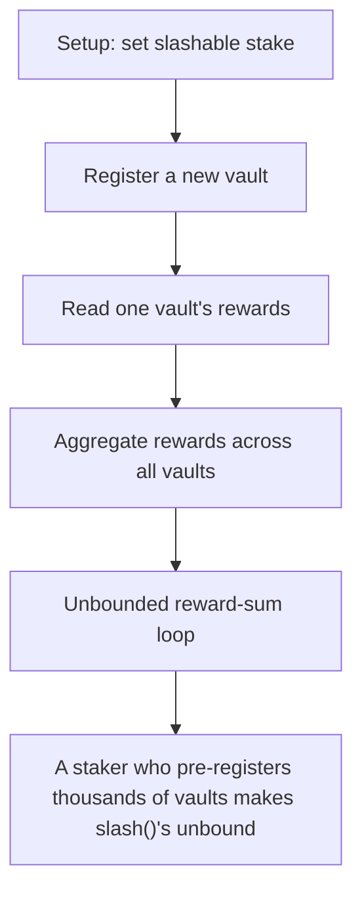

# Statusl: A staker who pre-registers thousands of vaults makes slash()'s unbounded per-vault reward-

> **Vulnerability classes:** vuln/locked-funds · vuln/reward-accounting
>
> **Reproduction:** a faithful minimal reproduction of the vulnerable finding — the vulnerable function is reproduced **verbatim** (marked `@>`) with faithful minimal doubles; local deploy, no fork.

<!-- source-auditvault: https://github.com/Auditware/AuditVault/blob/main/findings/65322-any-staker-can-fully-avoid-slashing-by-triggering-oog-revert.md -->

## Root cause

A staker who pre-registers thousands of vaults makes slash()'s unbounded per-vault reward-aggregation loop exceed the block gas limit, so slash() always OOG-reverts and the protocol can never seize the staker's 1000e18 slashable stake (slashing fully evaded).

```solidity
        uint256 accountTotalRewards = 0;

        for (uint256 i = 0; i < accountVaults.length; i++) {
            accountTotalRewards += rewardsBalanceOf(accountVaults[i]); // @> unbounded loop over attacker-controlled accountVaults → slash() OOGs (slash DoS/evasion)
        }
        return accountTotalRewards;
```

## Why it's exploitable here

A staker who pre-registers thousands of vaults makes slash()'s unbounded per-vault reward-aggregation loop exceed the block gas limit, so slash() always OOG-reverts and the protocol can never seize the staker's 1000e18 slashable stake (slashing fully evaded).

## Attack path



## Marked-line walkthrough (Playground)

The EVM Playground pins each step to the exact executed source line in `0x8ea53755a6…`:

1. **L89** — Setup: set slashable stake: Setup: `setSlashableStake` records the 1000e18 stake the protocol will later try, and fail, to seize.
2. **L102** — Register a new vault: Each registration derives a fresh vault address and appends it to `vaults[msg.sender]`, which the attacker inflates by the thousand.
3. **L118** — Read one vault's rewards: `rewardsBalanceOf` returns a single vault's rewards — called once per vault inside the aggregation loop.
4. **L134** — Aggregate rewards across all vaults: `rewardsBalanceOfAccount` loops over every vault the account registered — the cost that scales with attacker-registered vaults.
5. **L139** — Unbounded reward-sum loop: Root-cause bug: this per-vault `+=` runs over an unbounded, attacker-grown vault list, so `slash()` exhausts block gas and always reverts.
6. **L148** — Comment: OOG reverts slash: A source comment confirming that when the loop runs out of gas the whole `slash()` reverts and no stake is seized.
7. **L165** — View: account vault count: `vaultCountOf` exposes how many vaults an account holds — the count the attacker drives past the gas limit.

## PoC

Registry (Foundry, local deploy — verbatim vulnerable source + harm-asserting test + negative control):

```bash
cd 65322-any-staker-can-fully-avoid-slashing-by-triggering-oog-revert_exp
forge test -vvv
```

The browser Playground replays the same synthetic opcode-for-opcode and measures the harm: **A staker who pre-registers thousands of vaults makes slash()'s unbounded per-vault reward-aggregation loop exceed the block gas limit, so sl**. Both gates are green (registry `forge test` PASS + Playground `_verify-poc` **VERDICT: PASS**).
