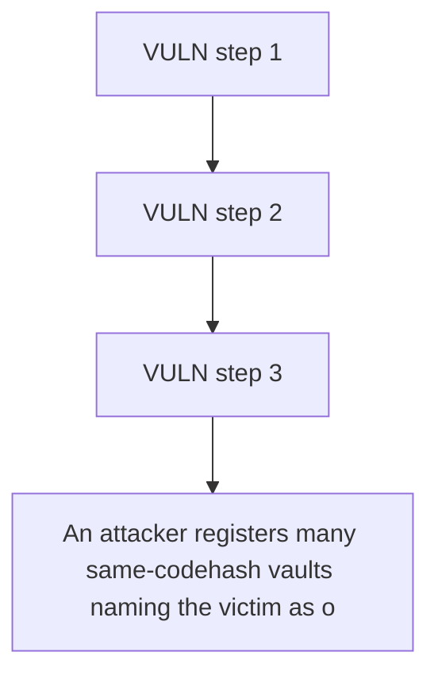

# Statusl: An attacker registers many same-codehash vaults naming the victim as owner

> **Vulnerability classes:** vuln/locked-funds · vuln/reward-accounting
>
> **Reproduction:** a faithful minimal reproduction of the vulnerable finding — the vulnerable function is reproduced **verbatim** (marked `@>`) with faithful minimal doubles; local deploy, no fork.

<!-- source-auditvault: https://github.com/Auditware/AuditVault/blob/main/findings/65324-malicious-actors-can-force-vaults-to-exit-if-they-wish-to-ge.md -->

## Root cause

An attacker registers many same-codehash vaults naming the victim as owner, inflating vaults[victim] until redeemRewards()/updateAccount() exceed the block gas limit, permanently locking the victim's 5,000 KARMA of accrued rewards (unclaimable unless a legitimate vault fully exits).

```solidity

        if (vaultOwners[vault] != address(0)) {
            revert StakeManager__VaultAlreadyRegistered();
        }

        vaultOwners[vault] = owner;
```

## Why it's exploitable here

An attacker registers many same-codehash vaults naming the victim as owner, inflating vaults[victim] until redeemRewards()/updateAccount() exceed the block gas limit, permanently locking the victim's 5,000 KARMA of accrued rewards (unclaimable unless a legitimate vault fully exits).

## Attack path



## Marked-line walkthrough (Playground)

The EVM Playground pins each step to the exact executed source line in `0x671d353a77…`:

1. **L195** — VULN step 1: no factory-only gate: any caller with the trusted vault codehash can register a vault for ANY owner
2. **L196** — VULN step 2: no factory-only gate: any caller with the trusted vault codehash can register a vault for ANY owner
3. **L197** — VULN step 3: no factory-only gate: any caller with the trusted vault codehash can register a vault for ANY owner

## PoC

Registry (Foundry, local deploy — verbatim vulnerable source + harm-asserting test + negative control):

```bash
cd 65324-malicious-actors-can-force-vaults-to-exit-if-they-wish-to-ge_exp
forge test -vvv
```

The browser Playground replays the same synthetic opcode-for-opcode and measures the harm: **An attacker registers many same-codehash vaults naming the victim as owner, inflating vaults[victim] until redeemRewards()/updateAccount() e**. Both gates are green (registry `forge test` PASS + Playground `_verify-poc` **VERDICT: PASS**).
