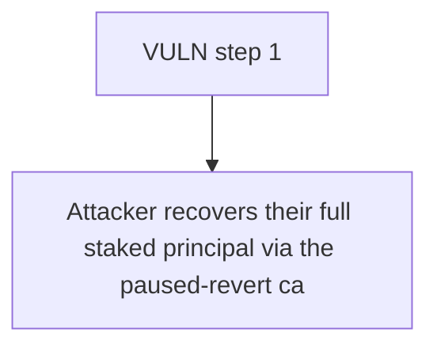

# Statusl: Attacker recovers their full staked principal via the paused-revert catch path while the S

> **Vulnerability classes:** vuln/theft · vuln/reward-accounting
>
> **Reproduction:** a faithful minimal reproduction of the vulnerable finding — the vulnerable function is reproduced **verbatim** (marked `@>`) with faithful minimal doubles; local deploy, no fork.

<!-- source-auditvault: https://github.com/Auditware/AuditVault/blob/main/findings/65325-malicious-actors-can-get-free-rewards-if-contract-gets-pause.md -->

## Root cause

Attacker recovers their full staked principal via the paused-revert catch path while the StakeManager still counts the phantom stake, letting them drain 50 reward tokens from the pool for free at honest stakers' expense.

```solidity
                    revert StakeVault__FailedToLeave();
                }
            }
        } catch { // @> try/catch swallows StakeManager.leave() revert: vault returns staked tokens while the manager keeps counting the stake
            if (lockUntil <= block.timestamp) {
                depositedBalance = 0;
```

## Why it's exploitable here

Attacker recovers their full staked principal via the paused-revert catch path while the StakeManager still counts the phantom stake, letting them drain 50 reward tokens from the pool for free at honest stakers' expense.

## Attack path



## Marked-line walkthrough (Playground)

The EVM Playground pins each step to the exact executed source line in `0xbd4fd5a3ce…`:

1. **L176** — VULN step 1: try/catch swallows StakeManager.leave() revert: vault returns staked tokens while the manager keeps counting the stake

## PoC

Registry (Foundry, local deploy — verbatim vulnerable source + harm-asserting test + negative control):

```bash
cd 65325-malicious-actors-can-get-free-rewards-if-contract-gets-pause_exp
forge test -vvv
```

The browser Playground replays the same synthetic opcode-for-opcode and measures the harm: **Attacker recovers their full staked principal via the paused-revert catch path while the StakeManager still counts the phantom stake, lettin**. Both gates are green (registry `forge test` PASS + Playground `_verify-poc` **VERDICT: PASS**).
