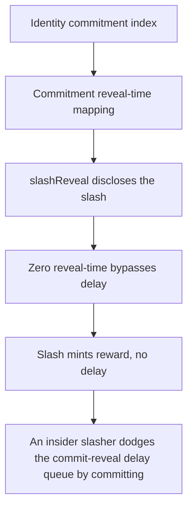

# Statusl: An insider slasher dodges the commit-reveal delay queue by committing against an unused

> **Vulnerability classes:** vuln/locked-funds · vuln/unfair-mint · vuln/reward-accounting
>
> **Reproduction:** a faithful minimal reproduction of the vulnerable finding — the vulnerable function is reproduced **verbatim** (marked `@>`) with faithful minimal doubles; local deploy, no fork.

<!-- source-auditvault: https://github.com/Auditware/AuditVault/blob/main/findings/65326-anyone-can-dodge-reveal-delays-by-providing-unrelated-accoun.md -->

## Root cause

An insider slasher dodges the commit-reveal delay queue by committing against an unused, unrelated account (0-delay revealStartTime) and revealing in the same block, minting the 1-token slashing reward to the attacker EOA that the honest, delay-abiding slasher should have received.

```solidity
        }

        delete slashCommitments[account][hash];
        slash(privateKey, rewardRecipient); // @> pays out without ever checking account == members[poseidonHash(privateKey)] — an unrelated account skips the reveal-delay queue
    }

```

## Why it's exploitable here

An insider slasher dodges the commit-reveal delay queue by committing against an unused, unrelated account (0-delay revealStartTime) and revealing in the same block, minting the 1-token slashing reward to the attacker EOA that the honest, delay-abiding slasher should have received.

## Attack path



## Marked-line walkthrough (Playground)

The EVM Playground pins each step to the exact executed source line in `0xbd4fd5a3ce…`:

1. **L107** — Identity commitment index: Setup: counter tracking registered identity commitments.
2. **L111** — Commitment reveal-time mapping: Setup: maps each account+hash to its `revealStartTime`, the moment its slash reveal becomes valid.
3. **L146** — slashReveal discloses the slash: Setup: `slashReveal` is the second step that reveals a committed slash and pays the reward.
4. **L158** — Zero reveal-time bypasses delay: Branches on `revealStartTime == 0`; committing against an unused, unrelated account leaves it zero so no delay applies.
5. **L167** — Slash mints reward, no delay: Root cause: reaches `slash()` and pays the reward without enforcing the reveal delay, since the commit was bound to an unrelated, same-block-revealable account.
6. **L171** — Internal slash pays recipient: Setup: `slash()` burns the target and mints the slashing reward to `rewardRecipient`.
7. **L196** — Define SLASHER_ROLE constant: Setup: the `SLASHER_ROLE` identifier gating who may slash.

## PoC

Registry (Foundry, local deploy — verbatim vulnerable source + harm-asserting test + negative control):

```bash
cd 65326-anyone-can-dodge-reveal-delays-by-providing-unrelated-accoun_exp
forge test -vvv
```

The browser Playground replays the same synthetic opcode-for-opcode and measures the harm: **An insider slasher dodges the commit-reveal delay queue by committing against an unused, unrelated account (0-delay revealStartTime) and rev**. Both gates are green (registry `forge test` PASS + Playground `_verify-poc` **VERDICT: PASS**).
