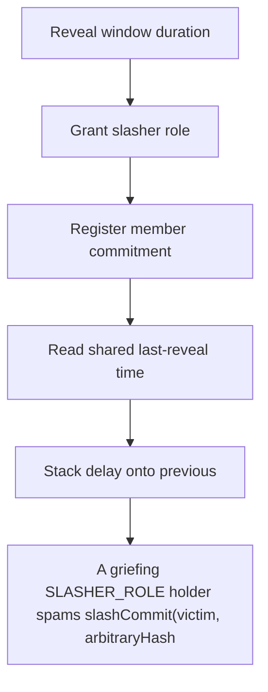

# Statusl: A griefing SLASHER_ROLE holder spams slashCommit(victim

> **Vulnerability classes:** vuln/unfair-mint · vuln/reward-accounting
>
> **Reproduction:** a faithful minimal reproduction of the vulnerable finding — the vulnerable function is reproduced **verbatim** (marked `@>`) with faithful minimal doubles; local deploy, no fork.

<!-- source-auditvault: https://github.com/Auditware/AuditVault/blob/main/findings/65327-any-slasher-can-increase-another-ones-reveal-delays-cyfrin-n.md -->

## Root cause

A griefing SLASHER_ROLE holder spams slashCommit(victim, arbitraryHash) to inflate the shared lastRevealStartTime[victim], pushing the honest slasher's real slashReveal 24*3600s (1 day) into the future so it reverts RLN__RevealWindowNotStarted, denying the honest slasher their 1000-KARMA slash reward for an attacker-chosen duration.

```solidity
        }

        slashCommitments[account][hash] = revealStartTime;
        lastRevealStartTime[account] = revealStartTime; // @> shared per-account queue write, NOT keyed by msg.sender: ANY slasher's commit inflates the reveal time the honest slasher later inherits
    }

```

## Why it's exploitable here

A griefing SLASHER_ROLE holder spams slashCommit(victim, arbitraryHash) to inflate the shared lastRevealStartTime[victim], pushing the honest slasher's real slashReveal 24*3600s (1 day) into the future so it reverts RLN__RevealWindowNotStarted, denying the honest slasher their 1000-KARMA slash reward for an attacker-chosen duration.

## Attack path



## Marked-line walkthrough (Playground)

The EVM Playground pins each step to the exact executed source line in `0xcc0e8eedd7…`:

1. **L137** — Reveal window duration: Setup: `slashRevealWindowTime` is the delay added before each reveal may begin.
2. **L157** — Grant slasher role: Setup: grants `SLASHER_ROLE` to an account.
3. **L162** — Register member commitment: Setup: registers a member's identity commitment into the tree.
4. **L171** — Read shared last-reveal time: Reads the victim's `lastRevealStartTime` — one shared per-account slot that every slasher writes.
5. **L177** — Stack delay onto previous: Computes the new reveal time as `lastReveal + slashRevealWindowTime`, stacking on top of the prior commit.
6. **L181** — Commit overwrites shared delay: Root cause: each commit overwrites the shared `lastRevealStartTime[account]`, so spam commits keep pushing an honest slasher's reveal further out, DoSing their reward.
7. **L187** — Read stored commitment time: Setup: reads back the stored `revealStartTime` for an account+hash during reveal.

## PoC

Registry (Foundry, local deploy — verbatim vulnerable source + harm-asserting test + negative control):

```bash
cd 65327-any-slasher-can-increase-another-ones-reveal-delays-cyfrin-n_exp
forge test -vvv
```

The browser Playground replays the same synthetic opcode-for-opcode and measures the harm: **A griefing SLASHER_ROLE holder spams slashCommit(victim, arbitraryHash) to inflate the shared lastRevealStartTime[victim], pushing the hones**. Both gates are green (registry `forge test` PASS + Playground `_verify-poc` **VERDICT: PASS**).
