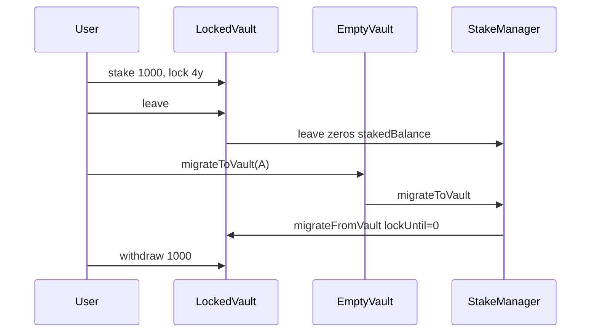

# Statusl — bypass stake lock via leave + migrateToVault

> **Vulnerability classes:** wrong-condition · indirect-loss · reward-accounting

> **Reproduction:** self-contained Foundry PoC with only `forge-std`.
> Full trace: [output.txt](output.txt). PoC:
> [test/65328-user-can-bypass-lock-and-withdraw-stake-anytime-cyfrin-none_exp.sol](test/65328-user-can-bypass-lock-and-withdraw-stake-anytime-cyfrin-none_exp.sol).

<!-- non-defihacklabs -->
<!-- source-auditvault: https://github.com/Auditware/AuditVault/blob/main/findings/65328-user-can-bypass-lock-and-withdraw-stake-anytime-cyfrin-none.md -->
<!-- date: 2026-01 -->

**AuditVault taxonomy:** `lang/solidity` · `platform/cyfrin` · `has/github` · `has/poc` · `severity/high` · `sector/staking` · genome: `wrong-condition` · `indirect-loss` · `reward-accounting`

---

## Key info

| | |
|---|---|
| **Impact** | **HIGH** — max-lock stake withdrawable immediately; up to 3x unfair reward share |
| **Protocol** | [Status Network / Statusl](https://github.com/status-im/status-network-monorepo) |
| **Vulnerable code** | `StakeManager.leave` + `migrateToVault` / `StakeVault.migrateFromVault` |
| **Bug class** | Missing `hasLeft` guard on migration target |
| **Finding** | Cyfrin Statusl2 v2.0, 2026-01-05 · #65328 · Samuraii77 |
| **Report** | [Cyfrin report](https://github.com/solodit/solodit_content/blob/main/reports/Cyfrin/2026-01-05-cyfrin-statusl2-v2.0.md) |
| **Source** | [AuditVault](https://github.com/Auditware/AuditVault/blob/main/findings/65328-user-can-bypass-lock-and-withdraw-stake-anytime-cyfrin-none.md) |
| **Status** | Fixed in `fb6c8ef` |
| **Compiler** | `^0.8.24` (PoC) |

---

## TL;DR

1. Stake with a multi-year lock for max multiplier.
2. `leave()` zeros `stakedBalance` but does not permanently ban the vault as a migrate target.
3. An empty vault migrates onto the left vault and overwrites `lockUntil` with 0.
4. Withdraw the full stake immediately.
5. HARM: lock bypass — max rewards with no lock downside.

---

## The vulnerable code

```solidity
_unstake(vault.stakedBalance, vault); // @> VULN: leave without blocking migrate-to
// ...
if (vaultOwners[migrateTo] == address(0)) revert; // @> VULN: no hasLeft check
if (vaultData[migrateTo].stakedBalance > 0) revert;
// ...
lockUntil = data.lockUntil; // @> VULN: empty source clears lock
```

**Fix:** disallow migrating to (or from) a vault with `hasLeft == true`.

---

## Root cause

Migration only checks registration and zero staked balance. A vault that has left is empty and still registered, so it accepts a migrate that writes `lockUntil = 0`.

---

## Preconditions

- User can create multiple vaults and call leave/migrate.
- Stake locked for a long period.

---

## Attack walkthrough

1. Stake 1000 tokens with a 4-year lock on vault A.
2. Create empty vault B.
3. `leave` on A — stake accounting cleared, tokens return to vault, `hasLeft` set but unused by migrate.
4. B migrates to A with zero lock metadata → A.`lockUntil = 0`.
5. Withdraw full stake from A immediately.

---

## Diagrams



---

## Impact

Users take max lock multiplier (6x vs 2x unlocked) then exit instantly, diluting honest locked stakers' rewards.

---

## Sources

- [AuditVault finding #65328](https://github.com/Auditware/AuditVault/blob/main/findings/65328-user-can-bypass-lock-and-withdraw-stake-anytime-cyfrin-none.md)
- [Cyfrin Statusl2 v2.0](https://github.com/solodit/solodit_content/blob/main/reports/Cyfrin/2026-01-05-cyfrin-statusl2-v2.0.md)
- Fix: [status-network-monorepo@fb6c8ef](https://github.com/status-im/status-network-monorepo/commit/fb6c8ef112477f831067edaf3abd3aa82b0503d9)
