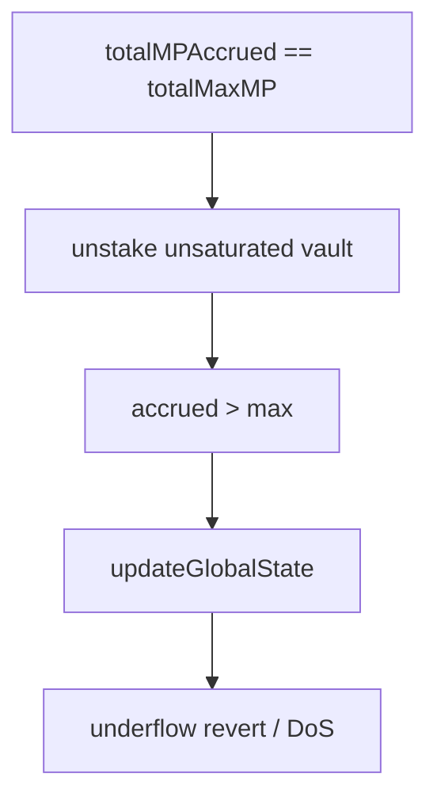

# Statusl — global MP cap broken on unstake causes permanent DoS

> **Vulnerability classes:** underflow · permanent · dos-resistance · integer-bounds · reward-accounting

> **Reproduction:** self-contained Foundry PoC with only `forge-std`.
> Full trace: [output.txt](output.txt). PoC:
> [test/65329-global-mp-cap-invariant-can-be-broken-on-unstake-causing-ari_exp.sol](test/65329-global-mp-cap-invariant-can-be-broken-on-unstake-causing-ari_exp.sol).

<!-- non-defihacklabs -->
<!-- source-auditvault: https://github.com/Auditware/AuditVault/blob/main/findings/65329-global-mp-cap-invariant-can-be-broken-on-unstake-causing-ari.md -->
<!-- date: 2026-01 -->

**AuditVault taxonomy:** `lang/solidity` · `sector/staking` · `platform/cyfrin` · `has/github` · `has/poc` · `severity/high` · `vuln/arithmetic/underflow` · `impact/dos/permanent` · genome: `underflow` · `permanent` · `dos-resistance` · `integer-bounds` · `reward-accounting` · `timestamp-dependence`

---

## Key info

| | |
|---|---|
| **Impact** | **HIGH** — permanent DoS of stake/unstake/rewards once time advances |
| **Protocol** | [Status Network / Statusl](https://github.com/status-im/status-network-monorepo) |
| **Vulnerable code** | `_unstake` global MP reduction + `_totalMP` clamp subtraction |
| **Bug class** | Broken invariant `totalMPAccrued <= totalMaxMP` → underflow |
| **Finding** | Cyfrin Statusl2 v2.0, 2026-01-05 · #65329 · Samuraii77 |
| **Report** | [Cyfrin report](https://github.com/solodit/solodit_content/blob/main/reports/Cyfrin/2026-01-05-cyfrin-statusl2-v2.0.md) |
| **Source** | [AuditVault](https://github.com/Auditware/AuditVault/blob/main/findings/65329-global-mp-cap-invariant-can-be-broken-on-unstake-causing-ari.md) |
| **Status** | Fixed in `56a7b64` |
| **Compiler** | `^0.8.24` (PoC) |

---

## TL;DR

1. Protocol assumes `totalMPAccrued <= totalMaxMP`.
2. Unstake reduces accrued and max MP proportionally to the vault's local values.
3. An unsaturated vault at a globally saturated moment removes more max than accrued.
4. Invariant flips: `totalMPAccrued > totalMaxMP`.
5. `_totalMP` does `totalMaxMP - totalMPAccrued` and underflows → DoS.

---

## The vulnerable code

```solidity
totalMPAccrued -= _deltaMpTotal; // @> VULN: asymmetric with deltaMax
totalMaxMP     -= _deltaMpMax;
// ...
accruedMP = totalMaxMP - totalMPAccrued; // @> VULN: underflows when accrued > max
```

**Fix:** clamp early when `totalMPAccrued >= totalMaxMP` before subtracting.

---

## Root cause

Local vault MP gap (`maxMP > mpAccrued`) is projected onto global aggregates without preserving the global cap invariant.

---

## Preconditions

- Global MP at cap (`totalMPAccrued == totalMaxMP`).
- A vault that is not fully saturated unstakes.

---

## Attack walkthrough

1. Saturated vault B fills global accrued to the global max.
2. Unsaturated vault A unstakes fully.
3. `deltaMax > deltaTotal` → global accrued exceeds global max.
4. Next `updateGlobalState` after time advances reverts on underflow.

---

## Diagrams



---

## Impact

All flows calling `_updateGlobalState` (stake, unstake, lock, rewards) permanently revert once time moves — protocol-level liveness failure.

---

## Sources

- [AuditVault finding #65329](https://github.com/Auditware/AuditVault/blob/main/findings/65329-global-mp-cap-invariant-can-be-broken-on-unstake-causing-ari.md)
- [Cyfrin Statusl2 v2.0](https://github.com/solodit/solodit_content/blob/main/reports/Cyfrin/2026-01-05-cyfrin-statusl2-v2.0.md)
- Fix: [status-network-monorepo@56a7b64](https://github.com/status-im/status-network-monorepo/commit/56a7b64a782150b2a87563621212b076e35f84f5)
