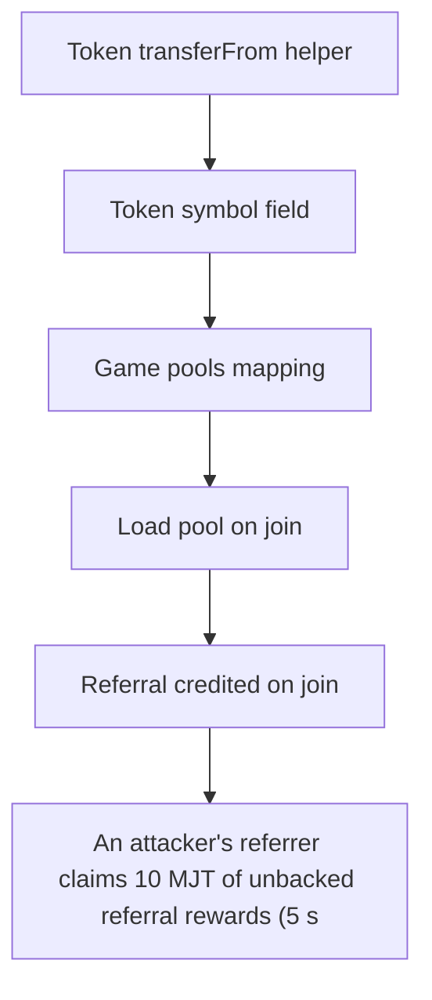

# Majority Protocol: An attacker's referrer claims 10 MJT of unbacked referral rewards (5 sock-puppets join+lea

> **Vulnerability classes:** vuln/theft · vuln/reward-accounting
>
> **Reproduction:** a faithful minimal reproduction of the vulnerable finding — the vulnerable function is reproduced **verbatim** (marked `@>`) with faithful minimal doubles; local deploy, no fork.

<!-- source-auditvault: https://github.com/Auditware/AuditVault/blob/main/findings/65372-depositmanager-refundentryfee-doesnt-deduct-referral-rewards.md -->

## Root cause

An attacker's referrer claims 10 MJT of unbacked referral rewards (5 sock-puppets join+leave a game at net-zero token cost while _refundEntryFee omits the referralRewards decrement), draining tokens honest players contributed to the pool and leaving it insolvent (290e18 < 300e18 owed to winners).

```solidity
        );
        pool.totalCollectedAmount += pool.ticketPrice;
        // @> _payEntryFee CREDITS the referrer on every join (paired with the omission below):
        referralRewards[gameId][Registry(registry).referrers(player)] += pool.ticketPrice * REFERRER_FEE;
        SafeERC20.safeTransferFrom(IERC20(pool.token), player, address(this), pool.ticketPrice);
    }
```

## Why it's exploitable here

An attacker's referrer claims 10 MJT of unbacked referral rewards (5 sock-puppets join+leave a game at net-zero token cost while _refundEntryFee omits the referralRewards decrement), draining tokens honest players contributed to the pool and leaving it insolvent (290e18 < 300e18 owed to winners).

## Attack path



## Marked-line walkthrough (Playground)

The EVM Playground pins each step to the exact executed source line in `0xce01759b82…`:

1. **L45** — Token transferFrom helper: Setup: helper that pulls `value` between accounts and requires the transfer to succeed.
2. **L52** — Token symbol field: Setup: token metadata storage.
3. **L120** — Game pools mapping: Setup: maps each `gameId` to its prize-pool accounting.
4. **L156** — Load pool on join: Loads the game's pool when a player joins and pays the entry fee.
5. **L168** — Referral credited on join: Root cause: credits the referrer on join but `_refundEntryFee` never reverses it, so a join-then-leave leaves an unbacked reward the referrer still claims.
6. **L172** — Refund omits referral decrement: The leave-time refund returns the entry fee but skips the matching `referralRewards` decrement.
7. **L194** — Leave triggers refund: Setup: `leave()` lets a player exit and invokes the flawed refund path.

## PoC

Registry (Foundry, local deploy — verbatim vulnerable source + harm-asserting test + negative control):

```bash
cd 65372-depositmanager-refundentryfee-doesnt-deduct-referral-rewards_exp
forge test -vvv
```

The browser Playground replays the same synthetic opcode-for-opcode and measures the harm: **An attacker's referrer claims 10 MJT of unbacked referral rewards (5 sock-puppets join+leave a game at net-zero token cost while _refundEntr**. Both gates are green (registry `forge test` PASS + Playground `_verify-poc` **VERDICT: PASS**).
