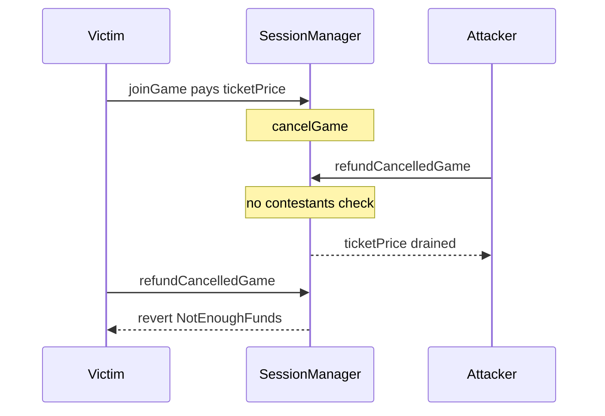

# Majority Protocol — refundCancelledGame missing join check

> **Reproduction:** self-contained Foundry PoC (forge-std only) — no fork.
> Full trace: [output.txt](output.txt).

<!-- non-defihacklabs -->
<!-- source-auditvault: https://github.com/Auditware/AuditVault/blob/main/findings/65373-attacker-can-drain-all-tokens-from-cancelled-game-since-sess.md -->
<!-- date: 2026-01 -->

**AuditVault taxonomy:** lang/solidity · platform/cyfrin · sector/gaming · severity/high · genome: missing · direct-drain · timestamp-dependence

---

## Key info

| | |
|---|---|
| **Impact** | **HIGH** — any cancelled game can be drained of entry fees by a permissionless attacker who never joined |
| **Protocol** | Majority Protocol (Engage / Majestic Games) |
| **Bug class** | Missing join check on refundCancelledGame |
| **Finding** | Cyfrin (Dacian) · #65373 · 2026-01-27 majority-protocol-v2.0 |
| **Report** | https://github.com/solodit/solodit_content/blob/main/reports/Cyfrin/2026-01-27-cyfrin-majority-protocol-v2.0.md |
| **Source** | [AuditVault](https://github.com/Auditware/AuditVault/blob/main/findings/65373-attacker-can-drain-all-tokens-from-cancelled-game-since-sess.md) |
| **Status** | Audit finding — reproduced as a standalone local synthetic |
| **Compiler** | `^0.8.24` (PoC) |

---

## TL;DR

`SessionManager.refundCancelledGame` only checks that the game is `Cancelled`, then refunds `ticketPrice` to `msg.sender` without verifying `contestants[gameId][msg.sender]`. An attacker who never joined can drain the entire cancelled-game pool; legitimate players then cannot refund.

**HARM:** attacker receives all deposited entry fees (10 USDC in the PoC); victim refund reverts `NotEnoughFunds`.

---

## Root cause

`_refundEntryFee` pays whoever calls; `refundCancelledGame` never gates on join status.

## Preconditions

A game has at least one paying contestant and is cancelled by the creator.

## Attack walkthrough

1. Victim joins and pays the entry fee.
2. Creator cancels the game.
3. Attacker (never joined) calls `refundCancelledGame` and receives `ticketPrice`.
4. Victim's refund reverts because the pool is empty.

## Diagrams

## Impact

Permissionless drain of every cancelled game's entry-fee balance.

## Sources

- [AuditVault finding](https://github.com/Auditware/AuditVault/blob/main/findings/65373-attacker-can-drain-all-tokens-from-cancelled-game-since-sess.md)
- Report: https://github.com/solodit/solodit_content/blob/main/reports/Cyfrin/2026-01-27-cyfrin-majority-protocol-v2.0.md
- Reduced source provenance: Engage-Protocol/engage-protocol @ cca0cb3; fixed in 7692203
