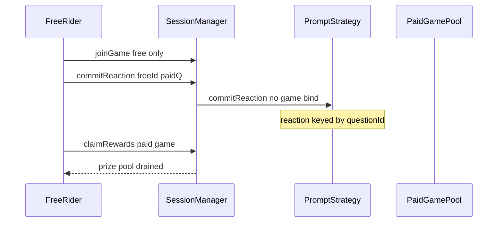

# Majority Protocol — free cross-game participation via unbound questionId

> **Reproduction:** self-contained Foundry PoC (forge-std only) — no fork.
> Full trace: [output.txt](output.txt).

<!-- non-defihacklabs -->
<!-- source-auditvault: https://github.com/Auditware/AuditVault/blob/main/findings/65374-users-can-participate-in-an-infinite-number-of-games-they-ha.md -->
<!-- date: 2026-01 -->

**AuditVault taxonomy:** lang/solidity · platform/cyfrin · sector/gaming · severity/high · genome: broken-logic · reward-theft · timestamp-dependence

---

## Key info

| | |
|---|---|
| **Impact** | **HIGH** — join one free game, play infinite paid games without entry fees, still win and claim prizes |
| **Protocol** | Majority Protocol |
| **Bug class** | Missing gameId↔questionId binding in commitReaction |
| **Finding** | Cyfrin (Dacian) · #65374 |
| **Report** | https://github.com/solodit/solodit_content/blob/main/reports/Cyfrin/2026-01-27-cyfrin-majority-protocol-v2.0.md |
| **Source** | [AuditVault](https://github.com/Auditware/AuditVault/blob/main/findings/65374-users-can-participate-in-an-infinite-number-of-games-they-ha.md) |
| **Status** | Audit finding — reproduced as a standalone local synthetic |
| **Compiler** | `^0.8.24` (PoC) |

---

## TL;DR

`commitReaction` only checks the caller joined `_gameId`, then forwards an arbitrary `_questionId` to the prompt strategy. Reactions are stored by `questionId` alone, so a free-game member can answer paid-game questions and claim winnings without paying that game's fee.

**HARM:** free-rider claims the paid game's entire prize pool (10 USDC).

---

## Root cause

No validation that `_questionId` belongs to `_gameId` in SessionManager or the strategy.

## Preconditions

At least one free/cheap game the attacker can join, and a funded paid game with a revealed question.

## Attack walkthrough

1. Create free game + paid game; victim funds paid game.
2. Attacker joins free game only.
3. Attacker `commitReaction(freeGameId, paidQuestionId, commit)` succeeds.
4. Attacker is ranked winner of the paid game and claims the pool.

## Diagrams

## Impact

Permanent bypass of all entry fees while remaining eligible to win and claim.

## Sources

- [AuditVault finding](https://github.com/Auditware/AuditVault/blob/main/findings/65374-users-can-participate-in-an-infinite-number-of-games-they-ha.md)
- Report: https://github.com/solodit/solodit_content/blob/main/reports/Cyfrin/2026-01-27-cyfrin-majority-protocol-v2.0.md
- Reduced source provenance: Engage-Protocol/engage-protocol @ cca0cb3; fixed in 62cafca / 01d5cc2 / f0e77f9
