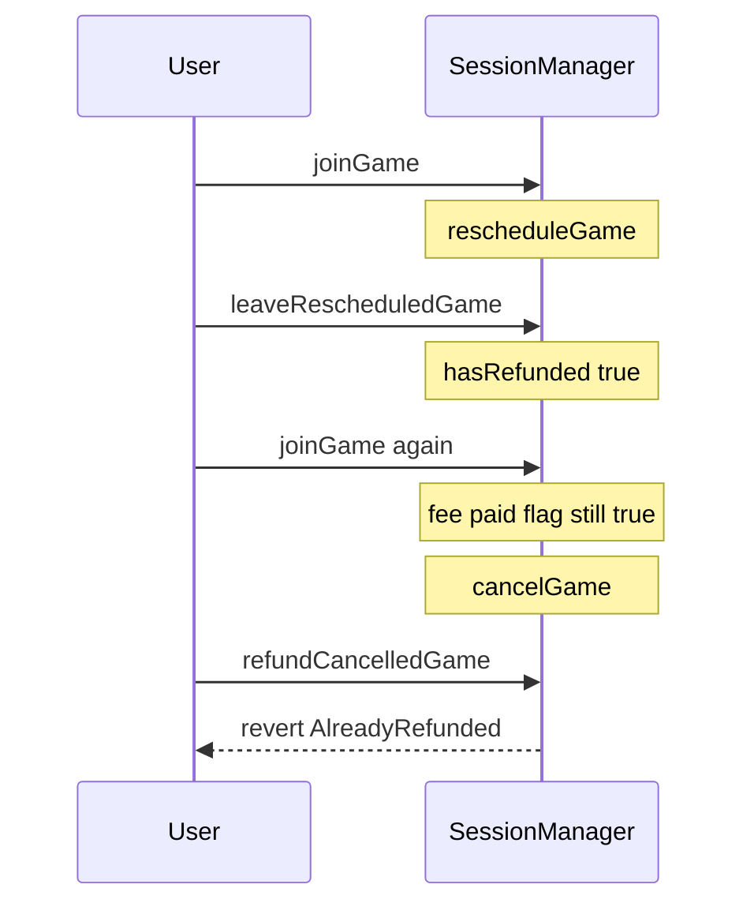

# Majority Protocol — re-join after leave permanently locks second entry fee

> **Reproduction:** self-contained Foundry PoC (forge-std only) — no fork.
> Full trace: [output.txt](output.txt).

<!-- non-defihacklabs -->
<!-- source-auditvault: https://github.com/Auditware/AuditVault/blob/main/findings/65375-impossible-for-user-to-get-refund-after-re-joining-a-resched.md -->
<!-- date: 2026-01 -->

**AuditVault taxonomy:** lang/solidity · platform/cyfrin · sector/gaming · severity/high · genome: frozen-funds · locked-funds · dos-resistance

---

## Key info

| | |
|---|---|
| **Impact** | **HIGH** — second entry fee permanently locked after leave/rejoin then cancel |
| **Protocol** | Majority Protocol |
| **Bug class** | hasRefunded not cleared on re-join / rejoin allowed after refund |
| **Finding** | Cyfrin (Dacian) · #65375 |
| **Report** | https://github.com/solodit/solodit_content/blob/main/reports/Cyfrin/2026-01-27-cyfrin-majority-protocol-v2.0.md |
| **Source** | [AuditVault](https://github.com/Auditware/AuditVault/blob/main/findings/65375-impossible-for-user-to-get-refund-after-re-joining-a-resched.md) |
| **Status** | Audit finding — reproduced as a standalone local synthetic |
| **Compiler** | `^0.8.24` (PoC) |

---

## TL;DR

After `leaveRescheduledGame` sets `hasRefunded[gameId][player]=true`, `_payEntryFee` on re-join never clears that flag. When the game is later cancelled, `refundCancelledGame` reverts `AlreadyRefunded` and the second fee stays in SessionManager forever.

**HARM:** 10 USDC stuck in SessionManager; player cannot recover the re-join fee.

---

## Root cause

`hasRefunded` is sticky across re-joins; `_payEntryFee` does not reset it.

## Preconditions

Game is rescheduled so leave is allowed; player leaves (refunded), re-joins, then game is cancelled.

## Attack walkthrough

1. Join, reschedule, leave (refund + hasRefunded=true).
2. Re-join (pays again; flag still true).
3. Cancel; refund reverts AlreadyRefunded.
4. Second fee locked.

## Diagrams

## Impact

User funds permanently locked in the immutable SessionManager.

## Sources

- [AuditVault finding](https://github.com/Auditware/AuditVault/blob/main/findings/65375-impossible-for-user-to-get-refund-after-re-joining-a-resched.md)
- Report: https://github.com/solodit/solodit_content/blob/main/reports/Cyfrin/2026-01-27-cyfrin-majority-protocol-v2.0.md
- Reduced source provenance: Engage-Protocol/engage-protocol @ cca0cb3; fixed in 3ac5654
