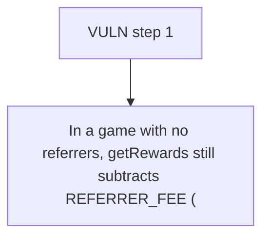

# Majority Protocol: In a game with no referrers

> **Vulnerability classes:** vuln/locked-funds · vuln/reward-accounting
>
> **Reproduction:** a faithful minimal reproduction of the vulnerable finding — the vulnerable function is reproduced **verbatim** (marked `@>`) with faithful minimal doubles; local deploy, no fork.

<!-- source-auditvault: https://github.com/Auditware/AuditVault/blob/main/findings/65376-depositmanagergetrewards-always-includes-referrer-fee-result.md -->

## Root cause

In a game with no referrers, getRewards still subtracts REFERRER_FEE (2%), so 2% of the pool (20e18 of 1000e18) is withheld from the winner and locked in DepositManager as an unclaimable referral accrued to address(0).

```solidity
     */
    function getRewards(uint256 gameId) public view returns (uint256) {
        return gamePools[gameId].totalCollectedAmount
            * (BASIS_POINTS - (gamePools[gameId].creatorFee + gamePools[gameId].protocolFee + REFERRER_FEE)) / BASIS_POINTS; // @> REFERRER_FEE is subtracted unconditionally, even when the game had no referrers, so 2% of the pool is never paid to the winner and is stranded
    }

```

## Why it's exploitable here

In a game with no referrers, getRewards still subtracts REFERRER_FEE (2%), so 2% of the pool (20e18 of 1000e18) is withheld from the winner and locked in DepositManager as an unclaimable referral accrued to address(0).

## Attack path



## Marked-line walkthrough (Playground)

The EVM Playground pins each step to the exact executed source line in `0x671d353a77…`:

1. **L107** — VULN step 1: REFERRER_FEE is subtracted unconditionally, even when the game had no referrers, so 2% of the pool is never paid to the winner and is stranded

## PoC

Registry (Foundry, local deploy — verbatim vulnerable source + harm-asserting test + negative control):

```bash
cd 65376-depositmanagergetrewards-always-includes-referrer-fee-result_exp
forge test -vvv
```

The browser Playground replays the same synthetic opcode-for-opcode and measures the harm: **In a game with no referrers, getRewards still subtracts REFERRER_FEE (2%), so 2% of the pool (20e18 of 1000e18) is withheld from the winner **. Both gates are green (registry `forge test` PASS + Playground `_verify-poc` **VERDICT: PASS**).
