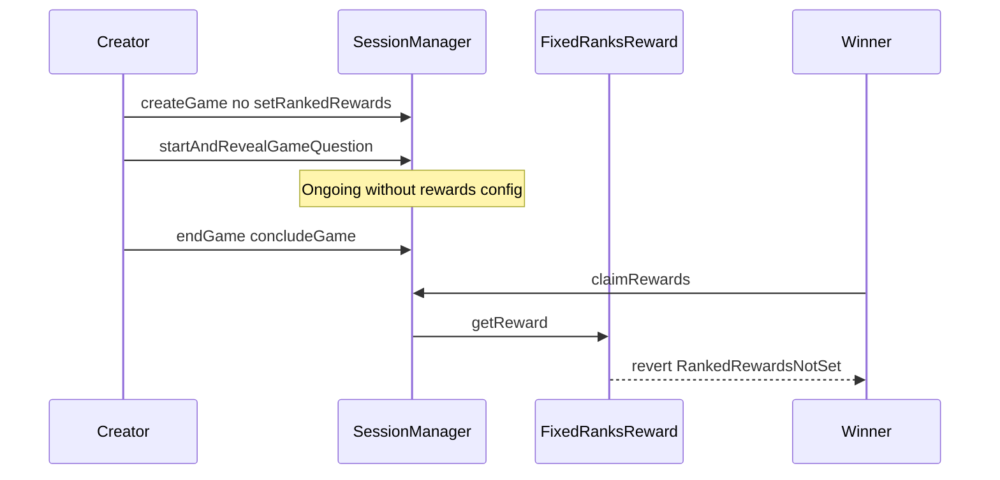

# Majority Protocol — start without ranked rewards locks prize pool

> **Reproduction:** self-contained Foundry PoC (forge-std only) — no fork.
> Full trace: [output.txt](output.txt).

<!-- non-defihacklabs -->
<!-- source-auditvault: https://github.com/Auditware/AuditVault/blob/main/findings/65377-impossible-to-claim-rewards-when-ranked-rewards-or-number-of.md -->
<!-- date: 2026-01 -->

**AuditVault taxonomy:** lang/solidity · platform/cyfrin · sector/gaming · severity/high · genome: frozen-funds · permanent · reward-accounting

---

## Key info

| | |
|---|---|
| **Impact** | **HIGH** — prize pool permanently locked if ranked rewards / number of winners never set before start |
| **Protocol** | Majority Protocol |
| **Bug class** | startAndRevealGameQuestion does not require rewardsConfigured |
| **Finding** | Cyfrin (Dacian) · #65377 |
| **Report** | https://github.com/solodit/solodit_content/blob/main/reports/Cyfrin/2026-01-27-cyfrin-majority-protocol-v2.0.md |
| **Source** | [AuditVault](https://github.com/Auditware/AuditVault/blob/main/findings/65377-impossible-to-claim-rewards-when-ranked-rewards-or-number-of.md) |
| **Status** | Audit finding — reproduced as a standalone local synthetic |
| **Compiler** | `^0.8.24` (PoC) |

---

## TL;DR

`FixedRanksReward.setRankedRewards` (and `ProportionalToXPReward.setNumberOfWinners`) require `Created` state, but the game can start and conclude without them. `claimRewards` then reverts `RankedRewardsNotSet` and tokens cannot be recovered.

**HARM:** 10 USDC prize pool locked in SessionManager forever.

---

## Root cause

No `rewardsConfigured` gate on `startAndRevealGameQuestion`.

## Preconditions

Game created with FixedRanksReward strategy; creator never calls setRankedRewards.

## Attack walkthrough

1. Create + join without setting ranked rewards.
2. Start → end → conclude with a winner.
3. setRankedRewards now reverts (not Created).
4. claimRewards reverts RankedRewardsNotSet.

## Diagrams

## Impact

All entry fees / prize funds permanently unclaimable once Concluded.

## Sources

- [AuditVault finding](https://github.com/Auditware/AuditVault/blob/main/findings/65377-impossible-to-claim-rewards-when-ranked-rewards-or-number-of.md)
- Report: https://github.com/solodit/solodit_content/blob/main/reports/Cyfrin/2026-01-27-cyfrin-majority-protocol-v2.0.md
- Reduced source provenance: Engage-Protocol/engage-protocol @ cca0cb3; fixed in a2e353e / 96d5fbe
