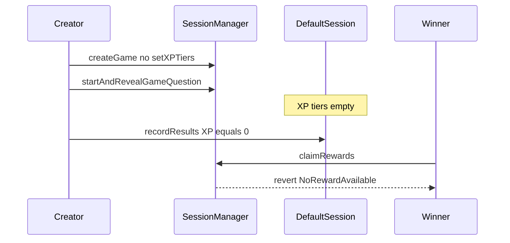

# Majority Protocol — start without XPTiers yields zero unclaimable rewards

> **Reproduction:** self-contained Foundry PoC (forge-std only) — no fork.
> Full trace: [output.txt](output.txt).

<!-- non-defihacklabs -->
<!-- source-auditvault: https://github.com/Auditware/AuditVault/blob/main/findings/65378-impossible-to-claim-rewards-when-xptiers-are-not-set-resulti.md -->
<!-- date: 2026-01 -->

**AuditVault taxonomy:** lang/solidity · platform/cyfrin · sector/gaming · severity/high · genome: frozen-funds · permanent · timestamp-dependence

---

## Key info

| | |
|---|---|
| **Impact** | **HIGH** — without XP tiers, proportional rewards are zero and claim reverts; prize pool locked |
| **Protocol** | Majority Protocol |
| **Bug class** | startAndRevealGameQuestion does not require XP tiers |
| **Finding** | Cyfrin (Dacian) · #65378 |
| **Report** | https://github.com/solodit/solodit_content/blob/main/reports/Cyfrin/2026-01-27-cyfrin-majority-protocol-v2.0.md |
| **Source** | [AuditVault](https://github.com/Auditware/AuditVault/blob/main/findings/65378-impossible-to-claim-rewards-when-xptiers-are-not-set-resulti.md) |
| **Status** | Audit finding — reproduced as a standalone local synthetic |
| **Compiler** | `^0.8.24` (PoC) |

---

## TL;DR

`setXPTiers` is only allowed in `Created`, but the game can start without tiers. XP computation yields 0; `ProportionalToXPReward` then produces zero rewards and `_distributeRewards` reverts `NoRewardAvailable` — funds locked after Concluded.

**HARM:** 10 USDC prize pool locked; winner receives nothing.

---

## Root cause

No XP-tiers configured check on game start.

## Preconditions

ProportionalToXPReward path; creator sets numberOfWinners but not XP tiers.

## Attack walkthrough

1. Create game, set numberOfWinners, skip setXPTiers.
2. Start (allowed), record results with zero XP, conclude.
3. setXPTiers now fails; claimRewards reverts NoRewardAvailable.

## Diagrams

## Impact

Prize funds permanently unclaimable for ProportionalToXP games started without tiers.

## Sources

- [AuditVault finding](https://github.com/Auditware/AuditVault/blob/main/findings/65378-impossible-to-claim-rewards-when-xptiers-are-not-set-resulti.md)
- Report: https://github.com/solodit/solodit_content/blob/main/reports/Cyfrin/2026-01-27-cyfrin-majority-protocol-v2.0.md
- Reduced source provenance: Engage-Protocol/engage-protocol @ cca0cb3; fixed in 65727de
