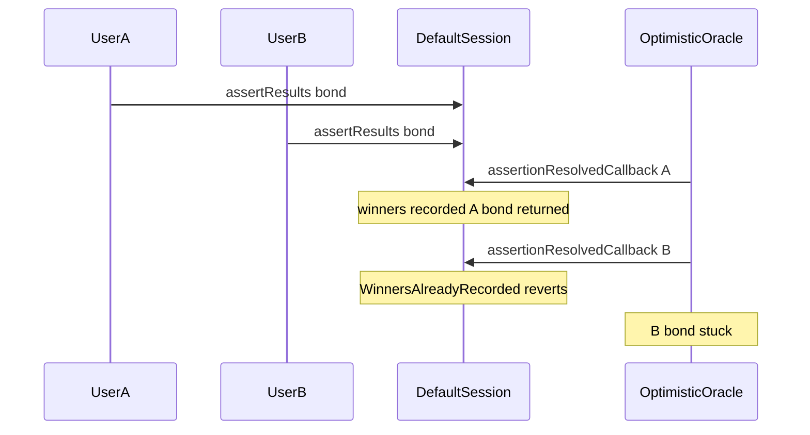

# Majority Protocol — multi assertResults causes bond loss for all but first

> **Reproduction:** self-contained Foundry PoC (forge-std only) — no fork.
> Full trace: [output.txt](output.txt).

<!-- non-defihacklabs -->
<!-- source-auditvault: https://github.com/Auditware/AuditVault/blob/main/findings/65379-if-multiple-users-call-defaultsessionassertresults-all-but-t.md -->
<!-- date: 2026-01 -->

**AuditVault taxonomy:** lang/solidity · platform/cyfrin · sector/gaming · severity/high · genome: missing-modifier · direct-drain · dos-resistance

---

## Key info

| | |
|---|---|
| **Impact** | **HIGH** — second (and later) assertResults callers permanently lose their UMA USDC bonds |
| **Protocol** | Majority Protocol |
| **Bug class** | No per-session uniqueness on assertDataFor; recordResults reverts on second resolve |
| **Finding** | Cyfrin (Dacian) · #65379 |
| **Report** | https://github.com/solodit/solodit_content/blob/main/reports/Cyfrin/2026-01-27-cyfrin-majority-protocol-v2.0.md |
| **Source** | [AuditVault](https://github.com/Auditware/AuditVault/blob/main/findings/65379-if-multiple-users-call-defaultsessionassertresults-all-but-t.md) |
| **Status** | Audit finding — reproduced as a standalone local synthetic |
| **Compiler** | `^0.8.24` (PoC) |

---

## TL;DR

`assertResults` is permissionless and accepts multiple bonds for the same `sessionId`. The first successful `recordResults` fills `winners[sessionId]`; the second reverts `WinnersAlreadyRecorded` inside the OO callback, so later asserters never recover their bonds (UMA docs: callbacks must not revert).

**HARM:** second asserter loses 250 USDC bond permanently.

---

## Root cause

No session-level assertion uniqueness; callback path reverts instead of no-op when winners already recorded.

## Preconditions

Game in Ended state; two users independently call assertResults with bonds.

## Attack walkthrough

1. User A asserts results (posts bond).
2. User B asserts same session (posts bond).
3. OO resolves A truthfully — winners set, A recovers bond.
4. OO resolves B — recordResults reverts; B's bond stuck.

## Diagrams

## Impact

All but the first successful asserter lose their minimum USDC bonds.

## Sources

- [AuditVault finding](https://github.com/Auditware/AuditVault/blob/main/findings/65379-if-multiple-users-call-defaultsessionassertresults-all-but-t.md)
- Report: https://github.com/solodit/solodit_content/blob/main/reports/Cyfrin/2026-01-27-cyfrin-majority-protocol-v2.0.md
- Reduced source provenance: Engage-Protocol/engage-protocol @ cca0cb3; fixed in 4c5483f
