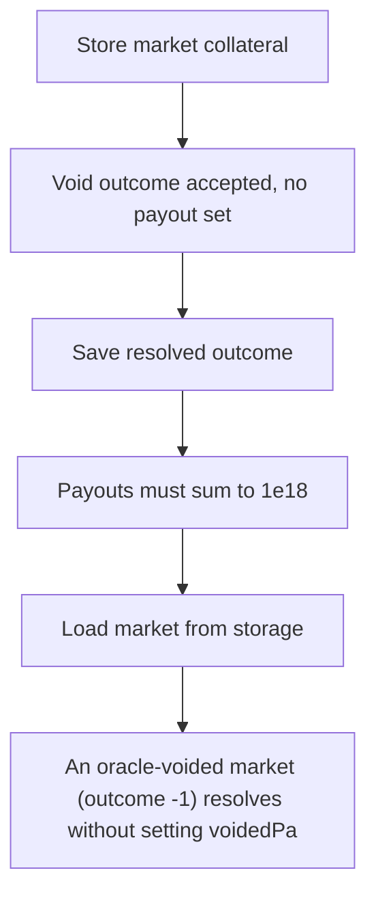

# Myriad: An oracle-voided market (outcome -1) resolves without setting voidedPayouts

> **Vulnerability classes:** vuln/locked-funds · vuln/price
>
> **Reproduction:** a faithful minimal reproduction of the vulnerable finding — the vulnerable function is reproduced **verbatim** (marked `@>`) with faithful minimal doubles; local deploy, no fork.

<!-- source-auditvault: https://github.com/Auditware/AuditVault/blob/main/findings/65418-oracle-void-outcome-leaves-predictionmarketv3managerclobvoid.md -->

## Root cause

An oracle-voided market (outcome -1) resolves without setting voidedPayouts, so every position holder's collateral (1e18) is permanently frozen in ConditionalTokens because redeemVoided reverts on require(0+0==1e18).

```solidity

        (int256 outcome, bool resolved) = IMarketOracle(market.oracle).getResult(marketId);
        require(resolved, "oracle: not resolved");
        require(outcome == 0 || outcome == 1 || outcome == -1, "invalid outcome"); // @> accepts -1 (VOIDED) but never sets voidedPayouts[marketId], leaving it [0,0]

        market.resolvedOutcome = outcome; // can be -1
```

## Why it's exploitable here

An oracle-voided market (outcome -1) resolves without setting voidedPayouts, so every position holder's collateral (1e18) is permanently frozen in ConditionalTokens because redeemVoided reverts on require(0+0==1e18).

## Attack path



## Marked-line walkthrough (Playground)

The EVM Playground pins each step to the exact executed source line in `0x671d353a77…`:

1. **L139** — Store market collateral: Setup: records the market's collateral token at creation.
2. **L149** — Void outcome accepted, no payout set: Root cause: resolution accepts void outcome `-1` as valid, but the void branch never sets `voidedPayouts`, leaving a voided market with no redeemable payout.
3. **L151** — Save resolved outcome: Stores the resolved outcome (including `-1`) yet writes no payout split for the void case.
4. **L162** — Payouts must sum to 1e18: Redemption requires payouts sum to `1e18`; for a void market both are 0, so `0+0==1e18` fails and `redeemVoided` reverts.
5. **L173** — Load market from storage: Setup: loads the target `Market` from storage during resolve/redeem.
6. **L192** — Fixed manager variant: Setup: the corrected manager contract used for comparison.
7. **L208** — Markets storage mapping: Setup: maps each `marketId` to its `Market` record.

## PoC

Registry (Foundry, local deploy — verbatim vulnerable source + harm-asserting test + negative control):

```bash
cd 65418-oracle-void-outcome-leaves-predictionmarketv3managerclobvoid_exp
forge test -vvv
```

The browser Playground replays the same synthetic opcode-for-opcode and measures the harm: **An oracle-voided market (outcome -1) resolves without setting voidedPayouts, so every position holder's collateral (1e18) is permanently fro**. Both gates are green (registry `forge test` PASS + Playground `_verify-poc` **VERDICT: PASS**).
