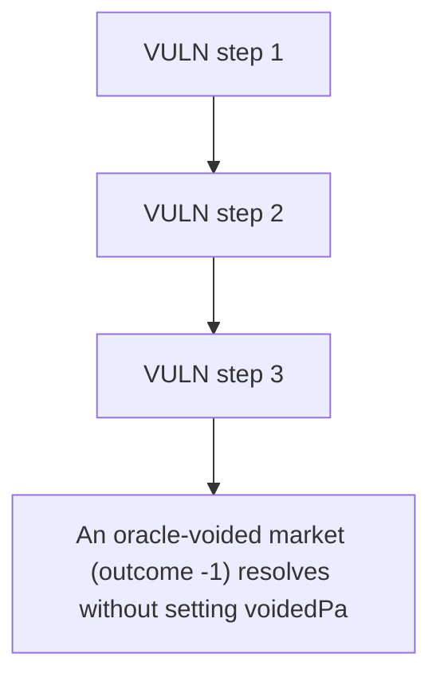

# Myriad: An oracle-voided market (outcome -1) resolves without setting voidedPayouts

> **Vulnerability classes:** vuln/locked-funds · vuln/price
>
> **Reproduction:** a faithful minimal reproduction of the vulnerable finding — the vulnerable function is reproduced **verbatim** (marked `@>`) with faithful minimal doubles; local deploy, no fork.

<!-- source-auditvault: https://github.com/Auditware/AuditVault/blob/main/findings/65418-oracle-void-outcome-leaves-predictionmarketv3managerclobvoid.md -->

## Root cause

An oracle-voided market (outcome -1) resolves without setting voidedPayouts, so every position holder's collateral (1e18) is permanently frozen in ConditionalTokens because redeemVoided reverts on require(0+0==1e18).

```solidity

        (int256 outcome, bool resolved) = IMarketOracle(market.oracle).getResult(marketId);
        require(resolved, "oracle: not resolved");
        require(outcome == 0 || outcome == 1 || outcome == -1, "invalid outcome"); // @> accepts -1 (VOIDED) but never sets voidedPayouts[marketId], leaving it [0,0]

        market.resolvedOutcome = outcome; // can be -1
```

## Why it's exploitable here

An oracle-voided market (outcome -1) resolves without setting voidedPayouts, so every position holder's collateral (1e18) is permanently frozen in ConditionalTokens because redeemVoided reverts on require(0+0==1e18).

## Attack path



## Marked-line walkthrough (Playground)

The EVM Playground pins each step to the exact executed source line in `0x671d353a77…`:

1. **L149** — VULN step 1: accepts -1 (VOIDED) but never sets voidedPayouts[marketId], leaving it [0,0]
2. **L151** — VULN step 2: accepts -1 (VOIDED) but never sets voidedPayouts[marketId], leaving it [0,0]
3. **L152** — VULN step 3: accepts -1 (VOIDED) but never sets voidedPayouts[marketId], leaving it [0,0]

## PoC

Registry (Foundry, local deploy — verbatim vulnerable source + harm-asserting test + negative control):

```bash
cd 65418-oracle-void-outcome-leaves-predictionmarketv3managerclobvoid_exp
forge test -vvv
```

The browser Playground replays the same synthetic opcode-for-opcode and measures the harm: **An oracle-voided market (outcome -1) resolves without setting voidedPayouts, so every position holder's collateral (1e18) is permanently fro**. Both gates are green (registry `forge test` PASS + Playground `_verify-poc` **VERDICT: PASS**).
