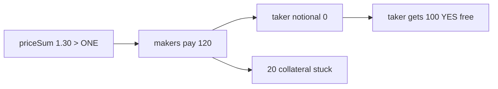

# Myriad CLOB — free YES tokens when cross-market `priceSum > ONE`

> **Vulnerability classes:** wrong-condition · direct-drain · locked-funds

> **Reproduction:** self-contained Foundry PoC with only `forge-std`.
> Full trace: [output.txt](output.txt). PoC:
> [test/65419-myriadctfexchangematchcrossmarketorders-allows-taker-to-rece_exp.sol](test/65419-myriadctfexchangematchcrossmarketorders-allows-taker-to-rece_exp.sol).

<!-- non-defihacklabs -->
<!-- source-auditvault: https://github.com/Auditware/AuditVault/blob/main/findings/65419-myriadctfexchangematchcrossmarketorders-allows-taker-to-rece.md -->
<!-- date: 2026-03 -->

**AuditVault taxonomy:** `lang/solidity` · `sector/dex` · `sector/lending` · `platform/cyfrin` · `has/github` · `has/poc` · `severity/high` · `impact/loss-of-funds/direct-drain` · `impact/loss-of-funds/locked-funds` · genome: `wrong-condition` · `direct-drain` · `locked-funds`

---

## Key info

| | |
|---|---|
| **Impact** | **HIGH** — taker receives YES for free; surplus collateral stuck forever |
| **Protocol** | [Myriad / Polkamarkets CLOB](https://github.com/Polkamarkets/polkamarkets-js) |
| **Vulnerable code** | `MyriadCTFExchange.matchCrossMarketOrders` |
| **Bug class** | `priceSum >= ONE` allows overpay; taker notional clamped to 0 |
| **Finding** | Cyfrin Myriad CLOB v2.0, 2026-03-13 · #65419 · Kiki |
| **Report** | [Cyfrin report](https://github.com/solodit/solodit_content/blob/main/reports/Cyfrin/2026-03-13-cyfrin-myriad-clob-v2.0.md) |
| **Source** | [AuditVault](https://github.com/Auditware/AuditVault/blob/main/findings/65419-myriadctfexchangematchcrossmarketorders-allows-taker-to-rece.md) |
| **Status** | Fixed in `c820bcf` / `d4300b9` |
| **Compiler** | `^0.8.24` (PoC) |

---

## TL;DR

1. Cross-market match requires only `priceSum >= ONE`, not equality.
2. Maker notionals sum with round-down; taker pays `max(0, fill - notionalSoFar)`.
3. When `priceSum > ONE`, makers overpay and taker notional becomes 0.
4. Taker still receives full `fillAmount` YES tokens.
5. Surplus collateral remains on the exchange with no withdraw path.

---

## The vulnerable code

```solidity
require(priceSum >= ONE, "price sum < 1"); // @> VULN
notional = notionalSoFar >= fillAmount ? 0 : fillAmount - notionalSoFar; // @> VULN
```

**Fix:** each buyer pays their price; route surplus to treasury/feeModule; prefer `priceSum == ONE`.

---

## Root cause

Remainder-based taker notional assumes maker notionals never exceed fill. That holds for `priceSum == ONE` (modulo dust) but fails when operators pass a higher sum.

---

## Preconditions

- Operator (or attacker with operator role) matches orders with `priceSum > ONE`.
- Makers have approved collateral.

---

## Attack walkthrough

1. Build three buy orders priced 0.60 + 0.60 + 0.10 = 1.30.
2. Match with `fillAmount = 100`.
3. Makers pay 60 + 60 = 120; taker pays 0.
4. All three receive 100 YES; 20 collateral stuck on exchange.

---

## Diagrams



---

## Impact

Taker steals value from overpaying makers; surplus is locked until an upgrade/recovery path.

---

## Sources

- [AuditVault finding #65419](https://github.com/Auditware/AuditVault/blob/main/findings/65419-myriadctfexchangematchcrossmarketorders-allows-taker-to-rece.md)
- [Cyfrin Myriad CLOB v2.0](https://github.com/solodit/solodit_content/blob/main/reports/Cyfrin/2026-03-13-cyfrin-myriad-clob-v2.0.md)
- Fix: [polkamarkets-js@c820bcf](https://github.com/Polkamarkets/polkamarkets-js/commit/c820bcfbd28347c161529e0d89fab11eff9ee87f)
