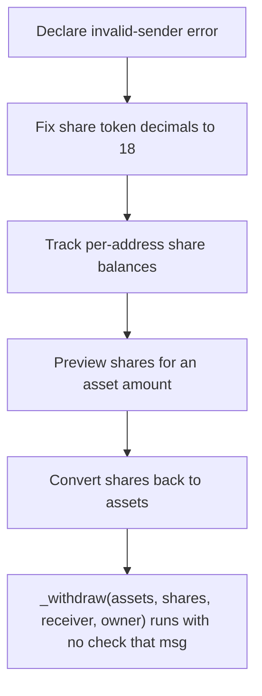

# SukukFi: withdraw()/redeem() lack a msg.sender==owner / allowance check

> **Vulnerability classes:** vuln/theft · vuln/access-control
>
> **Reproduction:** a faithful minimal reproduction of the vulnerable finding — the vulnerable function is reproduced **verbatim** (marked `@>`) with faithful minimal doubles; local deploy, no fork.

<!-- source-auditvault: https://github.com/Auditware/AuditVault/blob/main/findings/65495-h-01-missing-authorization-check-allows-unauthorized-fund-wi.md -->

## Root cause

_withdraw(assets, shares, receiver, owner) runs with no check that msg.sender is the owner or has the owner's allowance, so any caller burns the owner's shares and redirects the underlying to an arbitrary receiver — draining an approving depositor's entire position.

```solidity
    // ── verbatim withdraw (WERC7575Vault.sol L434-L437) ─────────────────────
    function withdraw(uint256 assets, address receiver, address owner) public nonReentrant whenNotPaused returns (uint256 shares) {
        shares = previewWithdraw(assets);
        _withdraw(assets, shares, receiver, owner); // @> no msg.sender==owner / allowance(owner,msg.sender) check — any caller burns owner's shares and redirects the assets to `receiver`
    }

```

## Why it's exploitable here

Any unauthorized caller invokes WERC7575Vault.withdraw(assets, attacker, victim) — with no msg.sender==owner/allowance check — burning the victim's 1000 shares and redirecting 1000 underlying STOLEN-ASSET to the attacker EOA, so the victim loses their entire deposit.

## Attack path



## Marked-line walkthrough (Playground)

The EVM Playground pins each step to the exact executed source line in `0xce01759b82…`:

1. **L50** — Declare invalid-sender error: Setup: declares the `ERC20InvalidSender` custom error used by the underlying token implementation.
2. **L66** — Fix share token decimals to 18: Setup: hardcodes the share token's `decimals` to 18, feeding the later asset-to-share conversion math.
3. **L68** — Track per-address share balances: Setup: `balanceOf` maps each holder to their share balance — the victim's 1000 shares sit here until burned.
4. **L184** — Preview shares for an asset amount: `previewWithdraw` quotes how many shares an `assets` withdrawal would burn — a read-only helper with no authorization.
5. **L199** — Convert shares back to assets: `_convertToAssets` computes the underlying owed for a share count with directional rounding — the pure math behind withdraw.
6. **L228** — Enter withdraw with owner param: `withdraw(assets, receiver, owner)` accepts an arbitrary `owner` to pull from and `receiver` to pay, guarded only by reentrancy/pause.
7. **L230** — Burn owner's shares — no auth check: Root-cause bug: `_withdraw` runs with no `msg.sender==owner` or allowance check, so any caller burns the victim's shares and sends assets to `receiver`.

## PoC

Registry (Foundry, local deploy — verbatim vulnerable source + harm-asserting test + negative control):

```bash
cd 65495-h-01-missing-authorization-check-allows-unauthorized-fund-wi_exp
forge test -vvv
```

The browser Playground replays the same synthetic opcode-for-opcode and measures the harm: **Any unauthorized caller invokes WERC7575Vault.withdraw(assets, attacker, victim) — with no msg.sender==owner/allowance check — burning the victim's 1000 shares and redirecting 1000 underlying STOLEN-ASSET to the attacker EOA, so the victim loses their entire deposit.**. Both gates are green (registry `forge test` PASS + Playground `_verify-poc` **VERDICT: PASS**).
