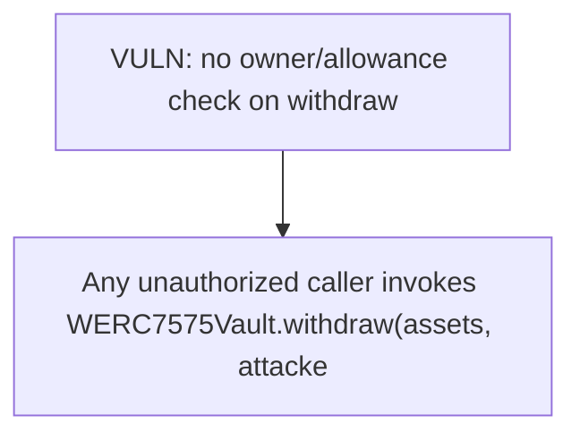

# SukukFi: withdraw()/redeem() lack a msg.sender==owner / allowance check

> **Vulnerability classes:** vuln/theft · vuln/access-control
>
> **Reproduction:** a faithful minimal reproduction of the vulnerable finding — the vulnerable function is reproduced **verbatim** (marked `@>`) with faithful minimal doubles; local deploy, no fork.

<!-- source-auditvault: https://github.com/Auditware/AuditVault/blob/main/findings/65495-h-01-missing-authorization-check-allows-unauthorized-fund-wi.md -->

## Root cause

_withdraw(assets, shares, receiver, owner) runs with no check that msg.sender is the owner or has the owner's allowance, so any caller burns the owner's shares and redirects the underlying to an arbitrary receiver — draining an approving depositor's entire position.

```solidity
    // ── verbatim withdraw (WERC7575Vault.sol L434-L437) ─────────────────────
    function withdraw(uint256 assets, address receiver, address owner) public nonReentrant whenNotPaused returns (uint256 shares) {
        shares = previewWithdraw(assets);
        _withdraw(assets, shares, receiver, owner); // @> no msg.sender==owner / allowance(owner,msg.sender) check — any caller burns owner's shares and redirects the assets to `receiver`
    }

```

## Why it's exploitable here

Any unauthorized caller invokes WERC7575Vault.withdraw(assets, attacker, victim) — with no msg.sender==owner/allowance check — burning the victim's 1000 shares and redirecting 1000 underlying STOLEN-ASSET to the attacker EOA, so the victim loses their entire deposit.

## Attack path



## Marked-line walkthrough (Playground)

The EVM Playground pins each step to the exact executed source line in `0xce01759b82…`:

1. **L230** — VULN: no owner/allowance check on withdraw: The attacker calls withdraw(assets, attacker, victim); the missing authorization check lets them burn the victim's shares and pull 1000 underlying to themselves.

## PoC

Registry (Foundry, local deploy — verbatim vulnerable source + harm-asserting test + negative control):

```bash
cd 65495-h-01-missing-authorization-check-allows-unauthorized-fund-wi_exp
forge test -vvv
```

The browser Playground replays the same synthetic opcode-for-opcode and measures the harm: **Any unauthorized caller invokes WERC7575Vault.withdraw(assets, attacker, victim) — with no msg.sender==owner/allowance check — burning the victim's 1000 shares and redirecting 1000 underlying STOLEN-ASSET to the attacker EOA, so the victim loses their entire deposit.**. Both gates are green (registry `forge test` PASS + Playground `_verify-poc` **VERDICT: PASS**).
