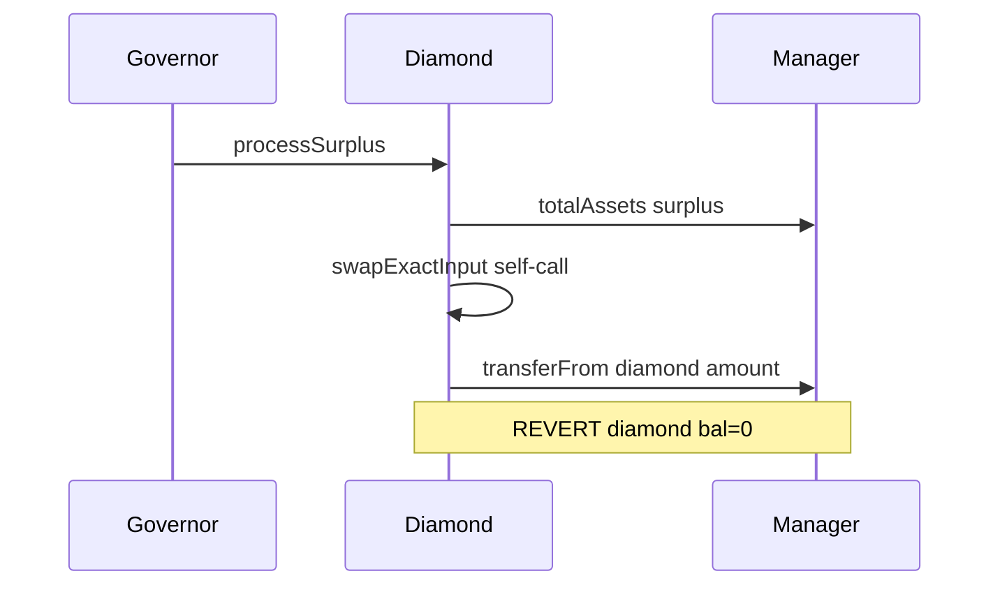

# Parallel 3.1 — processSurplus always reverts for managed collateral

> **Vulnerability classes:** frozen-funds · permanent · dos-resistance

> **Reproduction:** self-contained Foundry PoC with only `forge-std`.
> Full trace: [output.txt](output.txt). PoC:
> [test/65528-surplusprocesssurplus-always-reverts-for-managed-collateral_exp.sol](test/65528-surplusprocesssurplus-always-reverts-for-managed-collateral_exp.sol).

<!-- non-defihacklabs -->
<!-- source-auditvault: https://github.com/Auditware/AuditVault/blob/main/findings/65528-surplusprocesssurplus-always-reverts-for-managed-collateral.md -->
<!-- date: 2026-03 -->

**AuditVault taxonomy:** `lang/solidity` · `sector/governance` · `sector/lending` · `sector/stable` · `platform/cyfrin` · `has/github` · `has/poc` · `severity/high` · `impact/dos/permanent` · genome: `frozen-funds` · `permanent` · `dos-resistance`

---

## Key info

| | |
|---|---|
| **Impact** | **HIGH** — permanent DoS of surplus capture for all managed collateral |
| **Protocol** | [Parallel Parallelizer](https://github.com/parallel-protocol/parallel-parallelizer) |
| **Vulnerable code** | `Surplus.processSurplus` → `Swapper._swap` transferFrom diamond |
| **Bug class** | Surplus measured on manager; pull from diamond (balance always 0) |
| **Finding** | Cyfrin Parallel 3.1 v2.0, 2026-03-04 · #65528 · 0xStalin |
| **Report** | [Cyfrin report](https://github.com/solodit/solodit_content/blob/main/reports/Cyfrin/2026-03-04-cyfrin-parallel3.1-v2.0.md) |
| **Source** | [AuditVault](https://github.com/Auditware/AuditVault/blob/main/findings/65528-surplusprocesssurplus-always-reverts-for-managed-collateral.md) |
| **Status** | Fixed in `2dfad62` |
| **Compiler** | `^0.8.24` (PoC) |

---

## TL;DR

1. Managed collateral lives on an external manager/strategy, never on the diamond.
2. `getCollateralSurplus` correctly uses `manager.totalAssets()`.
3. `processSurplus` self-swaps and `transferFrom`s from the diamond.
4. Diamond balance is 0 → transfer reverts for any positive surplus.
5. HARM: strategy yield can never be captured as distributable tokenP.

---

## The vulnerable code

```solidity
IERC20(tokenIn).safeTransferFrom(
    msg.sender, // @> VULN: diamond has 0 managed collateral
    LibManager.transferRecipient(...),
    amountIn
);
```

**Fix:** `LibManager.release` surplus to the diamond before the self-swap.

---

## Root cause

Surplus accounting follows managed total assets, but the swap pull path assumes the diamond holds the tokens — true only for unmanaged collateral.

---

## Preconditions

- Collateral configured as managed (`isManaged`).
- Strategy has yield so surplus > 0.

---

## Attack walkthrough

1. Mint tokenP with managed collateral (tokens go user → manager).
2. Simulate strategy yield on the manager.
3. `getCollateralSurplus` reports positive surplus.
4. `processSurplus` reverts on `transferFrom(diamond, manager, surplus)`.

---

## Diagrams



---

## Impact

Permanent DoS on surplus processing for managed assets — the primary surplus source (strategy yield) is uncapturable.

---

## Sources

- [AuditVault finding #65528](https://github.com/Auditware/AuditVault/blob/main/findings/65528-surplusprocesssurplus-always-reverts-for-managed-collateral.md)
- [Cyfrin Parallel 3.1 v2.0](https://github.com/solodit/solodit_content/blob/main/reports/Cyfrin/2026-03-04-cyfrin-parallel3.1-v2.0.md)
- Fix: [parallel-parallelizer@2dfad62](https://github.com/parallel-protocol/parallel-parallelizer/commit/2dfad6252bf84c3b1d66607f8f9969a164bb26ff)
