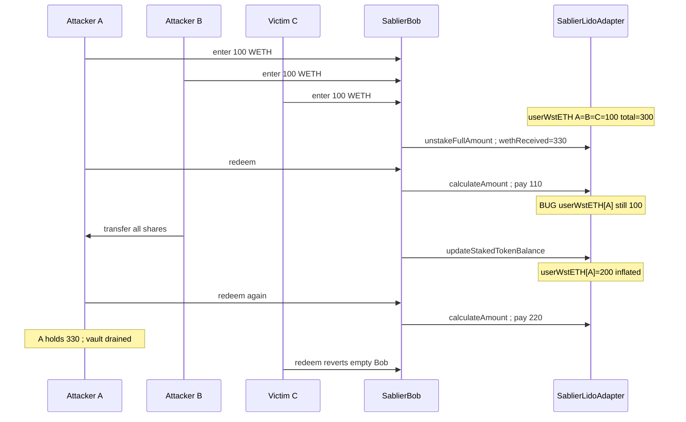
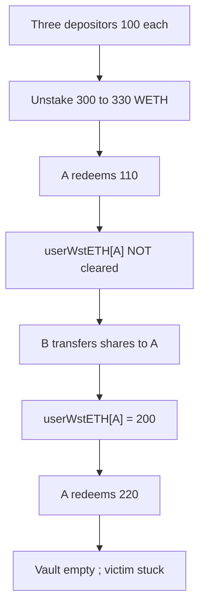

# Sablier Bob Escrow — Adapter vault `_userWstETH` not cleared after redemption enables theft of other users' funds

> **Vulnerability classes:** genome/state-update · impact/direct-drain · cross-contract-state-consistency

> **Reproduction:** a self-contained Foundry PoC that compiles & runs in an
> isolated project with **only `forge-std`** — no fork, no RPC, no warm
> `anvil_state` (the vulnerable adapter + Bob vault are deployed locally). Full
> trace: [output.txt](output.txt). PoC:
> [test/65582-adapter-vault-userwsteth-not-cleared-after-redemption-enabl_exp.sol](test/65582-adapter-vault-userwsteth-not-cleared-after-redemption-enabl_exp.sol).

<!-- non-defihacklabs -->
<!-- source-auditvault: https://github.com/Auditware/AuditVault/blob/main/findings/65582-adapter-vault-userwsteth-not-cleared-after-redemption-enabl.md -->
<!-- date: 2026-03 -->

---

## Key info

| | |
|---|---|
| **Impact** | **HIGH** — dual-address attacker drains an entire adapter vault's WETH; honest depositors' shares become unredeemable |
| **Protocol** | [Sablier](https://sablier.com) Bob Escrow (Lido adapter vaults) |
| **Vulnerable contract** | `SablierLidoAdapter` — `calculateAmountToTransferWithYield` + missing clear on `SablierBob::redeem`; `BobVaultShare::_update` skips burns |
| **Bug class** | Stale cross-contract state after burn/redeem; attribution mapping not cleared |
| **Finding** | Cyfrin — Sablier Bob Escrow v2.0, 2026-03-25 · #65582 |
| **Report** | [solodit Cyfrin report](https://github.com/solodit/solodit_content/blob/main/reports/Cyfrin/2026-03-25-cyfrin-sablier-bob-escrow-v2.0.md) |
| **Source** | [AuditVault](https://github.com/Auditware/AuditVault/blob/main/findings/65582-adapter-vault-userwsteth-not-cleared-after-redemption-enabl.md) |
| **Status** | Audit finding — fixed in [e7b4f7f](https://github.com/sablier-labs/lockup/commit/e7b4f7f22fa838da70d36e7555570fc3032f9705) (`processRedemption`). Reproduced here as a standalone local PoC. |
| **Compiler** | `^0.8.24` (PoC) |

This is an **audit finding**, not a historical on-chain incident — there is no
attack transaction. The PoC deploys a faithful minimal adapter vault locally
and demonstrates fund theft with a passing control test for contrast.

---

## TL;DR

1. Adapter vaults track each user's staked amount in `_userWstETH`.
2. On **redeem**, shares are burned and WETH is paid from
   `calculateAmountToTransferWithYield` — but **`_userWstETH` is never cleared**.
3. Burns also skip `BobVaultShare::_update`'s `onShareTransfer` notify
   (`to == address(0)`), so the adapter never hears about the burn either.
4. Attacker A redeems (stale `_userWstETH[A]` remains), B transfers shares to A
   (wstETH compounds onto the stale balance), A redeems again inflated.
5. A+B extract the **entire** vault WETH; the victim's redeem reverts.

---

## The vulnerable code

### `calculateAmountToTransferWithYield` — reads stale attribution

```solidity
function calculateAmountToTransferWithYield(
    uint256 vaultId,
    address user,
    uint128 /* shareBalance */
) external view returns (uint128 transferAmount, uint128 feeAmountDeductedFromYield) {
    uint256 totalWstETH = _vaultTotalWstETH[vaultId];
    uint256 totalWeth = _wethReceivedAfterUnstaking[vaultId];
    // ...

    // @> VULN: reads stale `_userWstETH` that is NEVER cleared on redeem
    uint256 userWstETH = _userWstETH[vaultId][user];

    uint128 userWethShare = uint128((userWstETH * totalWeth) / totalWstETH);
    transferAmount = userWethShare;
    feeAmountDeductedFromYield = 0;
}
```

### `BobVaultShare::_update` — burns skip the notify

```solidity
if (from != address(0) && to != address(0)) {
    ISablierBob(SABLIER_BOB).onShareTransfer(VAULT_ID, from, to, amount, fromBalanceBefore);
}
// Burns (to == address(0)) do NOT call onShareTransfer → adapter never clears
```

### Recommended fix

```solidity
// In SablierLidoAdapter:
function clearUserWstETH(uint256 vaultId, address user) external onlySablierBob {
    uint128 userWstETH = _userWstETH[vaultId][user];
    _userWstETH[vaultId][user] = 0;
    _vaultTotalWstETH[vaultId] -= userWstETH;
}

// In SablierBob::redeem, after calculateAmountToTransferWithYield:
vault.adapter.clearUserWstETH(vaultId, msg.sender);
```

(Shipped as `processRedemption` in commit `e7b4f7f`.)

---

## Root cause

Redemption burns the ERC-20 share but leaves the adapter's per-user wstETH
accounting intact. A subsequent share transfer moves *more* wstETH onto the
already-redeemed address, inflating the next payout. The two ledgers
(shares vs `_userWstETH`) diverge because burns do not update the adapter.

---

## Preconditions

- Adapter vault with at least three depositors (attacker A, attacker B, victim).
- Vault settled/expired so unstaking + redeem are available.
- Attacker controls two addresses that both deposited.

---

## Attack walkthrough

1. A, B, and C each deposit 100 WETH → `_userWstETH` = 100 each, total 300.
2. Unstake with yield → `_wethReceivedAfterUnstaking` = 330.
3. A redeems → paid 110 WETH; **`_userWstETH[A]` stays 100**.
4. B transfers all shares to A → `_userWstETH[A]` = 100 + 100 = 200.
5. A redeems again → paid 220 WETH (200/300 × 330).
6. Total A holds 330 WETH; C's redeem reverts (Bob empty).

---

## Diagrams





---

## Impact

- **Fund theft:** attacker with two addresses extracts the full vault WETH
  (capital + yield), including honest depositors' shares.
- **Concrete numbers in PoC:** 330 WETH drained; victim loses 110 WETH and is
  left with unredeemable shares.
- Severity HIGH — no special role required beyond two depositing addresses.

---

## Taxonomy (AuditVault)

- `severity/high`
- `sector/liquid-staking` · `sector/streaming` · `sector/token`
- `platform/cyfrin`
- genome: `state-update` · `direct-drain` · `cross-contract-state-consistency`

---

## Sources

- [AuditVault finding #65582](https://github.com/Auditware/AuditVault/blob/main/findings/65582-adapter-vault-userwsteth-not-cleared-after-redemption-enabl.md)
- [Cyfrin report — Sablier Bob Escrow v2.0 (2026-03-25)](https://github.com/solodit/solodit_content/blob/main/reports/Cyfrin/2026-03-25-cyfrin-sablier-bob-escrow-v2.0.md)
- Vulnerable source: [sablier-labs/lockup@75448ba](https://github.com/sablier-labs/lockup/tree/75448ba4e6f5f22207cc5b03096206a7708e5a54) — `bob/src/SablierLidoAdapter.sol`, `bob/src/SablierBob.sol`, `bob/src/BobVaultShare.sol` (parent of fix `e7b4f7f`)
- Fix: [e7b4f7f — processRedemption clears user wstETH](https://github.com/sablier-labs/lockup/commit/e7b4f7f22fa838da70d36e7555570fc3032f9705)
