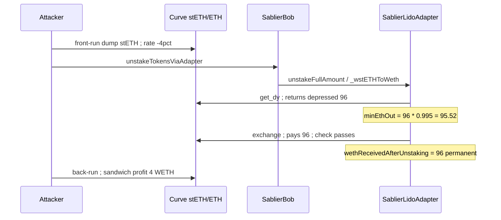
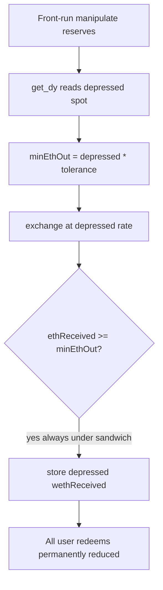

# Sablier Bob Escrow — Circular slippage protection in `SablierLidoAdapter::_wstETHToWeth` enables sandwich attacks

> **Vulnerability classes:** vuln/oracle/spot-price · impact/mev/sandwich · misassumption/price-cannot-be-manipulated

> **Reproduction:** a self-contained Foundry PoC that compiles & runs in an
> isolated project with **only `forge-std`** — no fork, no RPC. Full trace:
> [output.txt](output.txt). PoC:
> [test/65583-circular-slippage-protection-in-sablierlidoadapter-wstethtow_exp.sol](test/65583-circular-slippage-protection-in-sablierlidoadapter-wstethtow_exp.sol).

<!-- non-defihacklabs -->
<!-- source-auditvault: https://github.com/Auditware/AuditVault/blob/main/findings/65583-circular-slippage-protection-in-sablierlidoadapter-wstethtow.md -->
<!-- date: 2026-03 -->

---

## Key info

| | |
|---|---|
| **Impact** | **HIGH** — sandwich attacker steals a portion of every adapter vault's WETH at unstake; loss is permanent for all subsequent redemptions |
| **Protocol** | [Sablier](https://sablier.com) Bob Escrow (Lido adapter) |
| **Vulnerable contract** | `SablierLidoAdapter::_wstETHToWeth` |
| **Bug class** | On-chain slippage derived from manipulable DEX spot price (circular check) |
| **Finding** | Cyfrin — Sablier Bob Escrow v2.0, 2026-03-25 · #65583 |
| **Report** | [solodit Cyfrin report](https://github.com/solodit/solodit_content/blob/main/reports/Cyfrin/2026-03-25-cyfrin-sablier-bob-escrow-v2.0.md) |
| **Source** | [AuditVault](https://github.com/Auditware/AuditVault/blob/main/findings/65583-circular-slippage-protection-in-sablierlidoadapter-wstethtow.md) |
| **Status** | Audit finding — fixed by replacing Curve `get_dy` with Chainlink oracle ([2e0abaf](https://github.com/sablier-labs/lockup/commit/2e0abaf7b026126895443b416bd4bf3e7d6c9bea)). Reproduced here as a standalone local PoC. |
| **Compiler** | `^0.8.24` (PoC) |

This is an **audit finding**, not a historical on-chain incident. The PoC
models Curve reserve manipulation and shows the circular slippage check
passing while the vault permanently receives a depressed WETH amount.

---

## TL;DR

1. `_wstETHToWeth` sets `minEthOut` from Curve `get_dy` (current reserves).
2. `exchange` reads the **same** reserves — so a sandwich that depresses the
   pool makes both quote and swap use the manipulated price.
3. Slippage tolerance only guards movement *between* `get_dy` and `exchange`
   in the same tx (always zero) — the protection is **circular**.
4. `unstakeTokensViaAdapter` is **permissionless** — attacker chooses timing.
5. Depressed rate is written once to `_wethReceivedAfterUnstaking` → every
   user redeem forever pays less.

---

## The vulnerable code

```solidity
function _wstETHToWeth(uint128 wstETHAmount) private returns (uint128 wethReceived) {
    uint256 stETHAmount = WSTETH.unwrap(wstETHAmount);

    // @> VULN: minEthOut derived from get_dy (manipulable current reserves)
    uint256 expectedEthOut = CURVE_POOL.get_dy(1, 0, stETHAmount);
    uint256 minEthOut = (expectedEthOut * (UNIT - slippageTolerance)) / UNIT;
    uint256 ethReceived = CURVE_POOL.exchange(1, 0, stETHAmount, minEthOut);

    if (ethReceived < minEthOut) revert("slippage exceeded");
    return uint128(ethReceived);
}
```

### Recommended fix

Use a Chainlink stETH/ETH oracle (or caller-supplied `minEthOut`) instead of
the Curve spot quote:

```solidity
uint256 oraclePrice = _getStETHToETHOraclePrice();
uint256 fairEthOut = stETHAmount * oraclePrice / 1e18;
uint256 minEthOut = ud(fairEthOut).mul(UNIT.sub(slippageTolerance)).unwrap();
```

---

## Root cause

On-chain slippage floors computed from the same AMM spot the swap executes
against cannot detect a pre-transaction sandwich. The check only proves
`exchange` did not move *further* after `get_dy` in the same atomic call —
which is always true.

---

## Preconditions

- Adapter vault with staked wstETH ready to unstake.
- Attacker can manipulate Curve stETH/ETH reserves (flashloan) and call
  `unstakeTokensViaAdapter` (permissionless once settled).

---

## Attack walkthrough

1. **Front-run:** dump stETH into Curve → stETH/ETH rate −4%.
2. **Call** `unstakeTokensViaAdapter`:
   - `get_dy` → 96 (depressed)
   - `minEthOut` → 96 × 0.995 = 95.52
   - `exchange` → 96, **passes**
3. **Back-run:** restore pool; keep sandwich profit (4 WETH in the PoC).
4. `_wethReceivedAfterUnstaking` = 96 forever → all redemptions short ~4%.

---

## Diagrams





---

## Impact

- Attacker steals the gap between fair and manipulated stETH/ETH rate on every
  adapter-vault unstake they sandwich.
- Loss capped per vault by max slippage tolerance (~5%), but **cumulative**
  across all vaults the attacker monitors.
- PoC: 100 WETH vault → 96 to users, **4 WETH** sandwich profit; ≥3% permanent loss.

---

## Taxonomy (AuditVault)

- `severity/high`
- `sector/dex` · `sector/liquid-staking` · `sector/streaming` · `sector/oracle`
- `platform/cyfrin`
- genome: `spot-price` · `sandwich` · `defi/sandwich-attack` · `known-pattern`
- `misassumption/oracle-is-reliable` · `misassumption/price-cannot-be-manipulated`
- `fix/use-twap`

---

## Sources

- [AuditVault finding #65583](https://github.com/Auditware/AuditVault/blob/main/findings/65583-circular-slippage-protection-in-sablierlidoadapter-wstethtow.md)
- [Cyfrin report — Sablier Bob Escrow v2.0 (2026-03-25)](https://github.com/solodit/solodit_content/blob/main/reports/Cyfrin/2026-03-25-cyfrin-sablier-bob-escrow-v2.0.md)
- Vulnerable source: [sablier-labs/lockup@3c669df](https://github.com/sablier-labs/lockup/tree/3c669df3ffd53828fe3b6ec6284316f76bdabb70) — `bob/src/SablierLidoAdapter.sol` `_wstETHToWeth` (parent of oracle fix `2e0abaf`)
- Fix: [2e0abaf — Chainlink oracle for minEthOut](https://github.com/sablier-labs/lockup/commit/2e0abaf7b026126895443b416bd4bf3e7d6c9bea) · [7fae842 — revert on zero oracle price](https://github.com/sablier-labs/lockup/commit/7fae8429bdb2b88d4b0e63dcf25eb8a1477e5a8a)
- Pattern reference: [On-chain slippage calculation can be manipulated](https://dacian.me/defi-slippage-attacks#heading-on-chain-slippage-calculation-can-be-manipulated)
